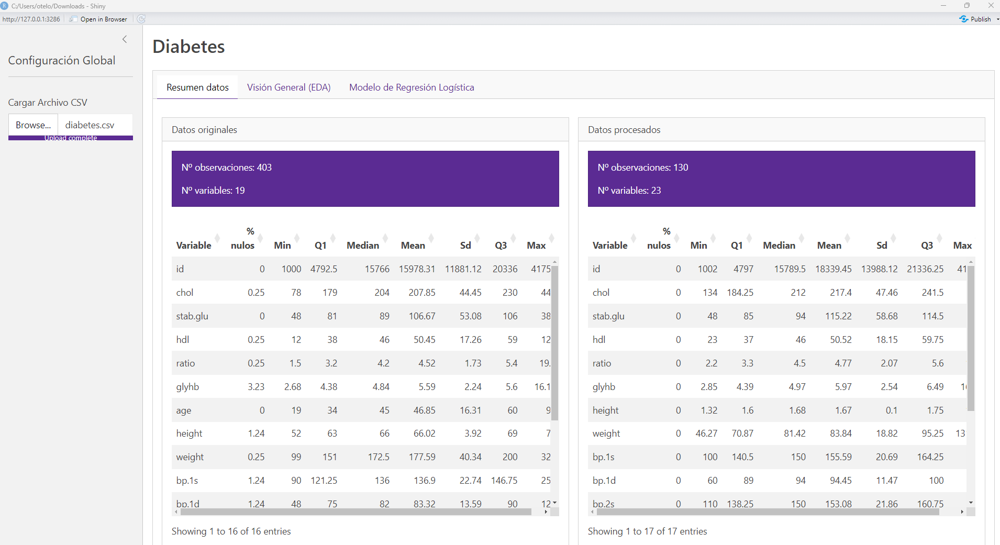
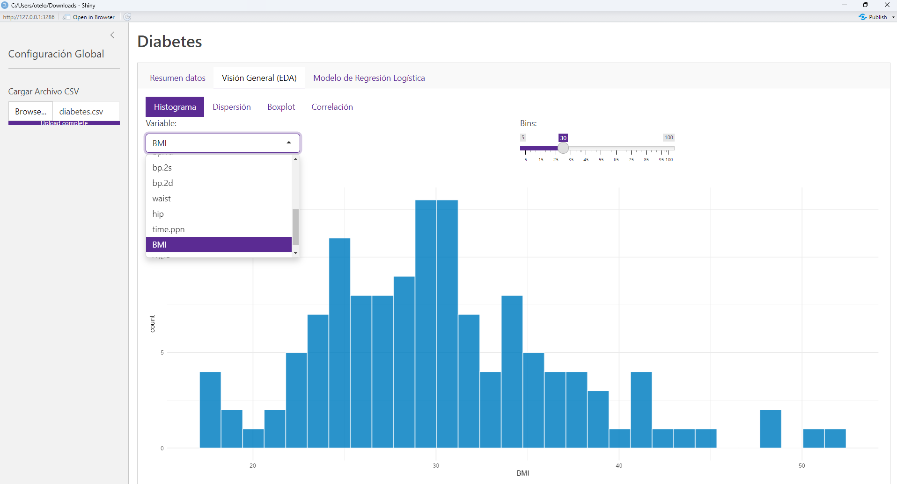
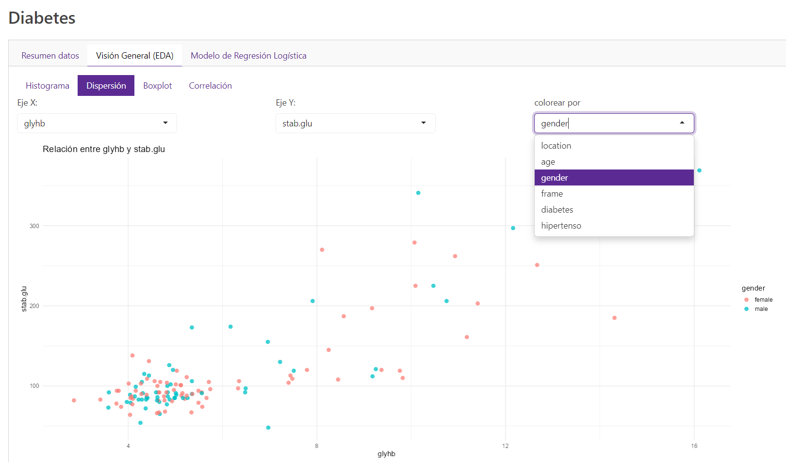
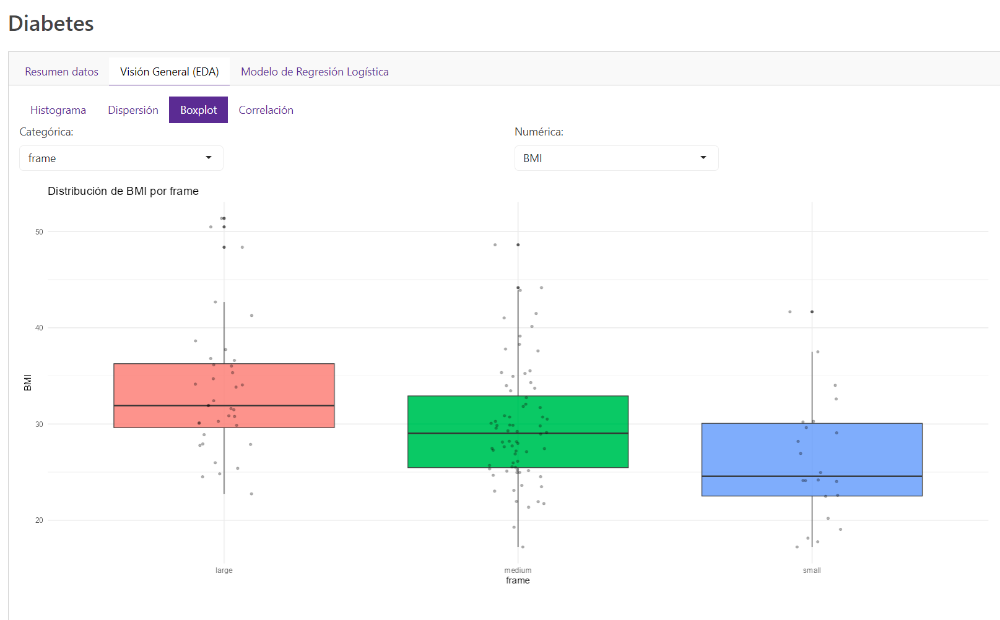
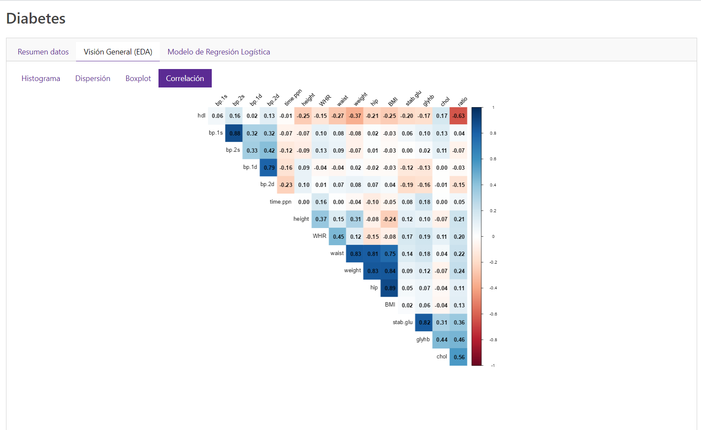
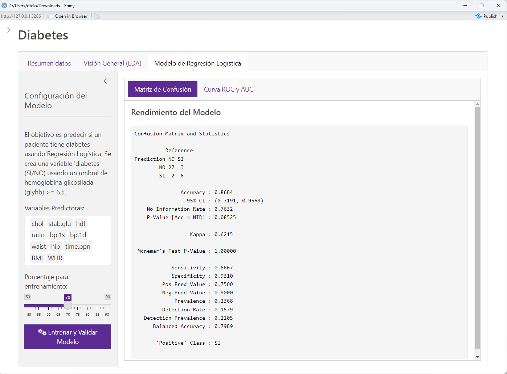
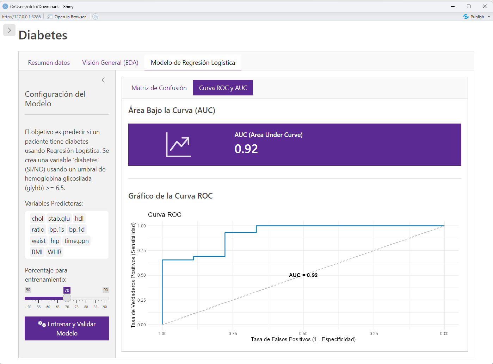

\tableofcontents  
\newpage


```{r setup, include=FALSE}
knitr::opts_chunk$set(echo = TRUE)
```

# Sección 1. Contexto y objetivo del estudio.

Para realizar esta actividad hemos seleccionado el conjunto de datos "Diabetes data", cedidos por el Dr. Dr John Schorling de la Facultad de Medicina de la Universidad de Virgina y publicados en la página <https://hbiostat.org/data/>. Este conjunto de datos consta de 19 variables medidas para 403 sujetos, y su objetivo original era analizar la prevalencia de la obesidad, la diabetes y otros factores de riesgo cardiovascular en individuos afroamericanos de Virginia central.Las variables que contien son: ID del paciente, nivel de colesterol, nivel de glucosa estable en sangre en ayunas, nivel de HDL, relación entre colesterol total y colesterol HDL, el nivel de hemoglobina glicosilada, la ubicación geográfica del paciente, la edd, el sexo, la altura, el peso, la complexión, el diámetro de la cintura, el diámetro de la cadera, la tensión sistólica y diastólica medidas en 2 ocasiones y el tiempo transcurrido entre la última comida y el análisis. 

Nuestro propósito de partida era examinar las relaciones estadísticas entre múltiples marcadores o parámetros biológicos, en una N de sujetos lo más grande posible. Tras analizar distintos conjuntos, decidimos emplear el de Diabetes porque contiene múltiples variables que podemos representar y analizar en busca de correlaciones, así como una N de observaciones amplia (403). En definitiva, es un conjunto muy completo y permite hacer un buen estudio estadístico enmarcado en el ámbito biológico. 

Tras examinar cuidadosamente el conjunto de datos, nos propusimos usar la información contenida en él para buscar posibles marcadores que permitan realizar un diagnóstico temprano de la diabetes, o predecir qué pacientes son susceptibles de desarrollar diabetes en el futuro. Por ello, intentaremos, mediante estadística inferencial crear un modelo para predecir la diabetes.


## Inicialización entorno trabajo

```{r, echo=FALSE, warning=FALSE}
# definimos y establecemos el directorio de trabajo 
directorio_trabajo <- paste0(getwd(), ' ')
setwd(directorio_trabajo)  

# instalamos la librerias que vamos a utilizar
install_package <- function(package_name){
  if (!requireNamespace(package_name, quietly = TRUE)) {
    install.packages(package_name) 
  }

install_package("knitr")         # para la generación de tablas mas vistosas
install_package("glue")          # para formatear texto interpolando variables
install_package("ggplot")        # para crear gráficos flexibles
install_package("cowplot")       # para juntar gráficos de ggplot2 en el mismo lienzo
install_package("corrplot")      # para visualizar matrices de correlación
install_package("tidyverse")     # para la regresión logística
install_package("ISLR")          # para la regresión logística
install_package("ggeffects")     # para la regresión logística múltiple
install_package("caret")         # para crear y entrenar modelos predictivos
install_package("pROC")          # para la curva ROC
install_package("dplyr")         # manipulación flexible de datos
install_package("ggfortify")     # para repreentar gráficamente los resultados del PCA
install_package("ggpubr")
}

# cargamos las librerias que vamos a utilizar
library("knitr")                 # para la generación de tablas mas vistosas
library("glue")                  # para formatear texto interpolando variables  
library("ggplot2")               # para crear gráficos flexibles
library("cowplot")               # para juntar gráficos de ggplot2 en el mismo lienzo
library("corrplot")              # para visualizar matrices de correlación
library("tidyverse")             # para la regresión logística
library("ISLR")                  # para la regresión logística
library("ggeffects")             # para la regresión logística múltiple
library("caret")                 # para crear y entrenar modelos predictivos
library("pROC")                  # para la curva ROC
library("dplyr")                 # manipulación flexible de datos
library("ggfortify")             # para repreentar gráficamente los resultados del PCA
library("ggpubr")
```


# Sección 2. Prospección y preparación de los datos

Ahora, observaremos el contenido y la estructura del conjunto de datos, las variables presentes y su resumen estadístico, empleando las distintas funciones que hemos ido estudiando. Además, comprobaremos si contiene NAs y, en caso afirmativo, cuántos de ellos hay en cada columna.

## Descripción del conjunto de datos

{width="620"}

## Carga del dataset y exploración inicial

Cargamos el archivo que vamos a emplear para nuestro análisis y mostramos los tipos de datos que contiene:

```{r}
# cargamos el archivo
diabetes_df <- read.csv("data/diabetes.csv")

# vemos los tipos de datos en él
str(diabetes_df)

```

También sus primeras entradas: 

```{r}
  # Comprobamos las primeras entradas del dataset
head(diabetes_df)
```


### Análisis de variables numéricas

Para hacernos una buena idea de la distribución de los datos contenidos en este conjunto, vamos a calcular los principales estadísticos de sus variables numéricas. Para ello, creamos una función que nos devuelva el valor de todos ellos, empleando a su vez las pequeñas funciones específicas. Nos interesa conocer el porcentaje de NAs por columna, los valores mínimo y máximo, los cuartiles 1 y 3, la mediana, la media y la desviación estándar. En cada parámetro, empleamos el argumento "na.rm = TRUE" para descartar los NAs y evitar posibles complicaciones asociadas a ellos.

Para conocer estos datos de todas las variables numéricas, empleamos la función "lapply()", que permite pasar nuestra función columna por columna. La hacemos dependiente de una estructura condicional que sólo ejecute la función si la columna es numérica. Al final, representamos los resultados en forma de tabla, omitiendo la variable ID (ya que, aunque es numérica, no aporta ninguna información más que el número de paciente). 

```{r}
# Creamos una función para que la podamos reutilizar
estadisticos_columna <- function(col) {
  if (is.numeric(col)) {
    # Si es numérica, devolver resumen estadístico básico y el porcentaje de nulos
    # Para hacer el porcentaje basta con hacer la media del numero de nulos (nºnulos / nº valores de la columna)
    # Para los estadisticos eliminamos los valores faltantes con na.rm=TRUE
    return(c(
      Porcentaje_Nulos = round(mean(is.na(col)) * 100, 2),
      Min = round(min(col, na.rm = TRUE),2),
      Q1 = round(quantile(col, 0.25, na.rm = TRUE),2),
      Median = round(median(col, na.rm = TRUE),2),
      Mean = round(mean(col, na.rm = TRUE),2),
      Sd = round(sd(col, na.rm = TRUE),2),
      Q3 = round(quantile(col, 0.75, na.rm = TRUE),2),
      Max = round(max(col, na.rm = TRUE),2)
    ))
  } 
}

# creamos otra función para aplicar el resumen estadístico a un data.frame
estadisticas_numericas <- function(df) {
  
# Escogemos solo las variables numéricas
columnas_numericas <- df[,sapply(df, function(x) is.numeric(x))]

# Aplicamos la funcion de estadísticos para cada variable
estadisticos <- lapply(columnas_numericas,estadisticos_columna)

# Convertir lista de vectores a data.frame
tabla_resumen <- do.call(rbind, estadisticos)

# Cramos el dataframe final añadiendo el nombre de las variables como primera columna
tabla_resumen <- data.frame(
  Variable = rownames(tabla_resumen),
  tabla_resumen, row.names = NULL)

# Mostrar la tabla de forma bonita
knitr::kable(tabla_resumen,
             caption = "Estadísticos de variables numéricas ",
             align = "lrrrrrrrr")
}

estadisticas_numericas(diabetes_df[, -1])
```

### Transformaciones y creación de variables sintéticas

Vamos a descartar inicialmente las variables categóricas para poder hacer análisis estadísticos de las numéricas. Además, tenemos que transformar las magnitudes medidas para que estén en las unidades del sistema decimal, puesto que el peso está en libras y la altura en pulgadas.

```{r}
# función que pasa de pulgadas a metros
inches_to_meters <- function(inches) {
  meters <- inches * 0.0254
  return(meters)
}

# función que pasa de libras a kilos
pounds_to_kilos <- function(pounds){
  kilos <- pounds * 0.453592
}

# altura, cintura y cadera de pulgadas a metros:

variables_en_pulgadas <- c("height","hip","waist")

diabetes_df[variables_en_pulgadas] <- lapply(
  diabetes_df[variables_en_pulgadas],
  inches_to_meters
)

# peso de libras a kilos
diabetes_df$weight <- pounds_to_kilos(diabetes_df$weight)
```


Asimismo, utilizaremos las variables numéricas disponibles para generar otras nuevas que, basándonos en la literatura, consideramos informativas. Concretamente, el índice de masa corporal (BMI; peso/altura\^2) y la relación cadera/cintura (WHR). 

```{r}
# indice de masa corporal
diabetes_df$BMI <- diabetes_df$weight / diabetes_df$height^2

# ratio cintura cadera (Waist Hip Ratio)
diabetes_df$WHR <- diabetes_df$waist / diabetes_df$hip
```

Después de hacer las transformaciones necesarias y la creación de nuevas variables, veamos como queda finalmente nuestro conjunto de datos:

```{r}
# estadísticos principales, quitamos columna de ID
estadisticas_numericas(diabetes_df[, -1])
```

Es cierto que hay muchas variables que contienen NAs, pero en la mayoría de los casos son minoritarios. Las excepciones son las variables bp.2s y bp.2d, de las cuales faltan más de la mitad de observaciones. Por esta razón, hemos decidido descartar estas 2 variables de nuestro análisis.

### Análisis de variables categoricas

Con el objeto de poder trabajar mejor con los datos, eliminamos los NAs y factorizamos las variables categóricas. Esto permite evitar errores en los cálculos y representaciones, y facilitar la creación de gráficos con una variable independiente no numérica, respectivamente. 

```{r}
columnas_factorizables <- c("location", "gender", "frame")

diabetes_df[columnas_factorizables] <- lapply(
  diabetes_df[columnas_factorizables],
  as.factor)

  # Eliminamos el nivel extra de Frame
diabetes_df <- diabetes_df[diabetes_df$frame != "", ]  # Filtra filas con factor diferente de ""
diabetes_df$frame <- droplevels(diabetes_df$frame)    # Elimina el nivel vacío de los factores


str(diabetes_df[columnas_factorizables])

  # Factorizamos la edad
diabetes_df$age <- cut(diabetes_df$age,   # partimos la variable...
  breaks = seq(0, 100, by = 10),          # ...en intervalos de 10 años
  right = FALSE,                 # intervalo cerrado a la izquierda [x,y)
  include.lowest = TRUE          # incluye el primer valor en el primer grupo
)
```


### Objetivos del estudio

Una vez observados los datos, nos hemos planteado las siguientes preguntas/objetivos:

1)  En base al nivel de hemoglobina glicosilada, queremos saber, basándonos en la literatura, si el paciente puede ser clasificado como diabético. Hemos visto que normalmente se considera que una persona es diabética si presenta un nivel de GlyHb del 6,5% o más.

2)  En base a la tensión arterial, investigaremos si el paciente es hiper- o hipotenso. Se considera hipertenso si la PS es igual/mayor de 140 mmHg y la PD es igual/mayor de 90 mmHg. Se considera hipotenso si la PS es menor de 90 y la PD menor de 60.

3)  Estudiaremos la relación cintura/cadera (WHR) para ver cómo se relaciona este parámetro con la presencia/ausencia de diabetes diagnosticada.

4)  Estudiaremos el índice de masa corporal (BMI) para compararlo el WHR y con la presencia/ausencia de diabetes diagnosticada.

5)  Estudiaremos las relaciones entre las variables para ver qué parámetro/combinación de parámetros guarda mayor relación con la presencia o ausencia de diabetes.

6)  Intentaremos crear un modelo, basado en estos datos, que sirva para clasificar otros grupos de pacientes en "diabéticos" y "no diabéticos".


### Sintesis de variables categóricas

    -   Diabetes: $SI/NO$. Supondremos diabetes tipo 2 si el porcentaje de glucosa o azucar en sangre (glyhb) supera el 6.5% . Para simplificar no crearemos el grupo de prediabetes (glyhb entre 5.7 y 6.4%)

    -   Hipertenso: $SI/NO$. Supondremos hypertensión si la presión sistólica es mayor de 140 y la diastólica es mayor de 90

```{r}
# suponemos que es diabético si glyhb >= 6.5
diabetes_df$diabetes <- cut(diabetes_df$glyhb,
                            breaks = c(0,  6.49, Inf),
                            labels = c("NO","SI"),
                            right = TRUE) # right=TRUE => intervalo es (a, b]

diabetes_df$hipertenso <- as.factor(ifelse(
                                      diabetes_df$bp.1s >= 140 &
                                      diabetes_df$bp.1d >= 90,
                                      "SI",
                                      "NO")
                                    )
summary(diabetes_df[,c("diabetes","hipertenso")])
```


# Sección 3. Análisis exploratorio de los datos

## 3.1 Análisis descriptivo

```{r, fig.width=15, fig.height=9}
# quitamos las columnas que no nos interesan
diabetes_reducido <- diabetes_df %>%
  select(-c(id, bp.2s, bp.2d))

# ahora eliminamos los NAs
diabetes_df_limpio <- na.omit(diabetes_reducido)

# vemos los resultados
head(diabetes_df_limpio)
```

Para investigar posibles correlaciones entre las variables que podamos usar para guiar nuestro análisis, vamos a obtener la matriz de correlaciones y a representarla de gráficaemnte. Hemos escogido la herramienta corrplot() del paquete homónimo, ya que permite visualizar las relaciones entre variables de una forma muy sencilla.

```{r, fig.width=15, fig.height=9}
# seleccionamos las columnas numéricas
columnas_numericas <- diabetes_df_limpio[,sapply(diabetes_df_limpio, function(x) is.numeric(x))]

# creamos la matriz de correlación de las variables numéricas (quitando ID)
matriz_correlacion <- cor(columnas_numericas[, -c(1, 11, 12)], method = "pearson", use = "pairwise.complete.obs")

# representamos los datos de manera más amigable empleando la función corrplot()
corrplot(matriz_correlacion,
             method = "circle",     # Usamos objetos circulares
             type = "upper",        # Mostramos la esquina superior de la matriz
             tl.col = "black",      # Etiquetas con texto en negro
             tl.srt = 45,           # Rotamos el texto de las etiquetas
             addCoef.col =  NULL,   # Añadimos coeficientes si el método es 'number' o el tipo es 'full'
             number.cex = 0.7,      # Tamaño de los números si se muestran
             order = "hclust",      # Reordenamos las variables por clustering jerárquico para ver patrones
             na.label = "NA",       # Etiquetamos los NAs como tales
             na.label.col = "grey"
            )
```

Ahora, vamos a representar distintos gráficos que nos ayuden a evaluar visualmente estas relaciones entre variables. Hemos seleccionado el gráfico de cajas y bigotes (boxplot) para estudiar las relaciones entre variables categóricas y numéricas. Hemos empleado gráficos de dispersión para enfrentar variables numéricas entre sí. Nos serviremos de las herramientas del paquete "ggplot2" para hacer gráficos de manera flexible. Con la función "plot_grid()" hemos conseguido agrupar varios de estos gráficos en el mismo lienzo.

1) Boxplots

```{r, fig.width=15, fig.height=15}
# representamos el % de hemoglobina glicosilada (y) frente a la edad (x):
grafico_1 <- ggplot(diabetes_df_limpio, aes (x = age, y = glyhb)) +
  geom_boxplot() +     # Definimos tipo de gráfico
  xlab("Edad") +     # Etiqueta eje X
  ylab ("Hemoglobina glicosilada") +    # Etiqueta eje Y
  ggtitle ("Nivel de hemoglobina glicosilada según la edad") +    # Título gráfico
 theme_classic() +
  theme(    
    axis.title.x = element_text(margin = margin(t = 15)),
    axis.title.y = element_text(margin = margin(r = 15))
  )

# representamos el % de hemoglobina glicosilada (y) frente al sexo (x):
grafico_2 <- ggplot(diabetes_df_limpio, aes (x = gender, y = glyhb)) +
  geom_boxplot() +     # Definimos tipo de gráfico
  xlab("Sexo") +     # Etiqueta eje X
  ylab ("Hemoglobina glicosilada") +    # Etiqueta eje Y
  ggtitle ("Nivel de hemoglobina glicosilada según el sexo") +    # Título gráfico
 theme_classic() +
  theme(    
    axis.title.x = element_text(margin = margin(t = 10)),
    axis.title.y = element_text(margin = margin(r = 10))
  )

# representamos el % de hemoglobina glicosilada (y) frente a la constitución (x):
grafico_3 <- ggplot(diabetes_df_limpio, aes (x = frame, y = glyhb)) +
  geom_boxplot() +     # Definimos tipo de gráfico
  xlab("Complexión") +     # Etiqueta eje X
  ylab ("Hemoglobina glicosilada") +    # Etiqueta eje Y
  ggtitle ("Nivel de hemoglobina glicosilada según la complexión") +    # Título gráfico
 theme_classic() +
  theme(    
    axis.title.x = element_text(margin = margin(t = 15)),
    axis.title.y = element_text(margin = margin(r = 15))
  )

# representamos el % de hemoglobina glicosilada (y) frente a la presencia/ausencia de hipertensión (x):  
grafico_4 <- ggplot(diabetes_df_limpio, aes (x = hipertenso, y = glyhb)) +
  geom_boxplot() +     # Definimos tipo de gráfico
  xlab("Hipertensión") +     # Etiqueta eje X
  ylab ("Hemoglobina glicosilada") +    # Etiqueta eje Y
  ggtitle ("Relación entre hemoglobina glicosilada y tensión arterial") +    # Título gráfico
 theme_classic() +
  theme(    
    axis.title.x = element_text(margin = margin(t = 15)),
    axis.title.y = element_text(margin = margin(r = 15))
  )

# representamos la relación HDL/colesterol total (y) frente a la presencia/ausencia de diabetes (x):
grafico_5 <- ggplot(diabetes_df_limpio, aes (x = diabetes, y = ratio)) +
  geom_boxplot() +     # Definimos tipo de gráfico
  xlab("Diabetes") +     # Etiqueta eje X
  ylab ("Ratio") +    # Etiqueta eje Y
  ggtitle ("Relación entre Diabetes y ratio") +    # Título gráfico
 theme_classic() +
  theme(    
    axis.title.x = element_text(margin = margin(t = 15)),
    axis.title.y = element_text(margin = margin(r = 15))
  )

# agrupamos los gráficos en la misma figura
plot_grid(grafico_1, grafico_2, grafico_3, grafico_4, grafico_5,  ncol = 2, nrow =3)
```

Como podría haber una diferencia significativa entre los 2 grupos en el último gráfico, vamos 

```{r, echo=FALSE, warning=FALSE, message=FALSE}
grafico_5 <- ggplot(diabetes_df_limpio, aes (x = diabetes, y = ratio)) +
  geom_boxplot() +     # Definimos tipo de gráfico
  xlab("Diabetes") +     # Etiqueta eje X
  ylab ("Ratio") +    # Etiqueta eje Y
  ggtitle ("Comparación ratio HDL/colesterol total") +    # Título gráfico
 theme_classic() +
  theme(    
    axis.title.x = element_text(margin = margin(t = 15)),
    axis.title.y = element_text(margin = margin(r = 15))
  ) + 
  scale_fill_brewer(palette = "Set1")

# Añadir la comparación de medianas y las estrellas de significancia
grafico_estad <- grafico_5 + stat_compare_means(
  method = "wilcox.test",         # empleamos el test de Wilcoxon-Silk
  comparisons = list(c("NO", "SI")),
  label = "p.signif"              # Muestra las estrellas de significancia (p-valor)
)

grafico_estad
```


2) Gráficos de dispersión

```{r, fig.width=15, fig.height=15}

# representamos el % de hemoglobina glicosilada (y) frente a la relación cintura/cadera (x):
grafico_7 <- ggplot(diabetes_df_limpio, aes (x = WHR, y = glyhb)) +
  geom_point() +     # Definimos tipo de gráfico
  xlab("WHR") +     # Etiqueta eje X
  ylab ("Hemoglobina glicosilada") +    # Etiqueta eje Y
  ggtitle ("Relación entre hemoglobina glicosilada y ratio cintura/cadera") +    # Título gráfico
 theme_classic() +
  theme(    
    axis.title.x = element_text(margin = margin(t = 15)),
    axis.title.y = element_text(margin = margin(r = 15))
  )

# representamos el BMI (y) frente a la presencia/ausencia de hipertensión (x):
grafico_8 <- ggplot(diabetes_df_limpio, aes (x = BMI, y = hipertenso)) +
  geom_point() +     # Definimos tipo de gráfico
  xlab("BMI") +     # Etiqueta eje X
  ylab ("Hipertensión") +    # Etiqueta eje Y
  ggtitle ("Relación entre ratio cintura/cadera e hipertensión") +    # Título gráfico
 theme_classic() +
  theme(    
    axis.title.x = element_text(margin = margin(t = 15)),
    axis.title.y = element_text(margin = margin(r = 15))
  )

# representamos el % de hemoglobina glicosilada (y) frente al BMI (x):
grafico_9 <- ggplot(diabetes_df_limpio, aes (x = BMI, y = glyhb)) +
  geom_point() +     # Definimos tipo de gráfico
  xlab("BMI") +     # Etiqueta eje X
  ylab ("Hemoglobina glicosilada") +    # Etiqueta eje Y
  ggtitle ("Relación entre hemoglobina glicosilada y BMI") +    # Título gráfico
 theme_classic() +
  theme(    
    axis.title.x = element_text(margin = margin(t = 15)),
    axis.title.y = element_text(margin = margin(r = 15))
  )

# representamos el % de hemoglobina glicosilada (y) frente al nivel de glucosa en ayunas (x):
grafico_10 <- ggplot(diabetes_df_limpio, aes (x = stab.glu, y = glyhb)) +
  geom_point() +     # Definimos tipo de gráfico
  xlab("glucosa en ayunas") +     # Etiqueta eje X
  ylab ("Hemoglobina glicosilada") +    # Etiqueta eje Y
  ggtitle ("Relación entre hemoglobina glicosilada y glucosa en ayuas") +    # Título gráfico
 theme_classic() +
  theme(    
    axis.title.x = element_text(margin = margin(t = 15)),
    axis.title.y = element_text(margin = margin(r = 15))
  )

# representamos el % de hemoglobina glicosilada (y) frente a la relación HDL/colesterol total (x):
grafico_11 <- ggplot(diabetes_df_limpio, aes (x = ratio, y = glyhb)) +
  geom_point() +     # Definimos tipo de gráfico
  xlab("ratio HDL/colesterol total") +     # Etiqueta eje X
  ylab ("Hemoglobina glicosilada") +    # Etiqueta eje Y
  ggtitle ("Relación entre hemoglobina glicosilada y ratio HDL/colesterol total") +    # Título gráfico
 theme_classic() +
  theme(    
    axis.title.x = element_text(margin = margin(t = 15)),
    axis.title.y = element_text(margin = margin(r = 15))
  )

# agrupamos los gráficos en la misma figura
plot_grid(grafico_7, grafico_8, grafico_9, grafico_10, grafico_11, ncol = 2, nrow = 3)
```


## 3.2 Estudio probabilístico

Aunque no es el objetivo central de nuestro análisis, vamos a plantear una serie de supuestos probabilísticos para explorar cómo estas herramientas nos pueden permitir llevar a cabo predicciones basadas en nuestros datos.

Lo primero es conocer la frecuencia en nuestros datos de las dos condiciones que queremos estudiar: la diabetes y la hipertensión.

```{r}
# tabla de frecuencias de diabetes
frec<- table(diabetes_df_limpio$diabetes)/length(diabetes_df_limpio$diabetes)
print(frec) #tabla de frecuencias

# tabla de frecuencias de hipertensión
frec<- table(diabetes_df_limpio$hipertenso)/length(diabetes_df_limpio$hipertenso)
print(frec)
```

Si asumimos que éstas son las probabilidades para la ocurrencia de estos fenómenos (aunque esto es simplificar mucho la cuestión) podemos realizar algunas simulaciones probabilísticas de interés. Por ejemplo, si tuviéramos 1.000 pacientes, ¿cuál sería la probabilidad de que al menos 280 fueran diabéticos? ¿Y de que al menos 600 fueran hipertensos? Otro ejemplo: probabilidad de que al menos 300 tengan ambas patologías. Por último, la probabilidad de que menos del 30% sean diabéticos.

```{r}

  # Probabilidad de al menos 280 diabéticos
n = 1000 # número de pacientes
p1 = 0.25 # probabilidad de que el paciente sea diabético
val1 = 279 # valor exacto
paste("Probabilidad de que haya 280 o más diabéticos:", 1 - pbinom(val1, n, p1))

# Probabilidad de que menos de 200 sean diabéticos
paste("Probabilidad de que menos de 200 sean diabéticos:", pbinom (199, 1000, 0.25))

  # Probabilidad de al menos 600 hipertensos
n = 1000 # número de pacientes
p2 = 0.61 # probabilidad de que el paciente sea hipertenso
val2 = 599 # valor exacto
paste("Probabilidad de que haya 600 o más hipertensos:", 1 - pbinom(val2, n, p2))

  # Probabilidad de al menos 300 hipertensos diabéticos
paste("Probabilidad de que haya al menos 300 hipertensos diabéticos:", (1 - pbinom(299, n, p1)) * (1 - pbinom(299, n, p2)))
```

## Muestreo

Vamos a sacar una muestra al azar de nuestro grupo de pacientes y a comprobar si una variable cualquiera, como la hemoglobina glicosilada, se distribuye de manera normal en ellos. Primero se hace el muestreo. Luego, verificamos si la distribución es normal, tanto visualmente como con un test estadístico (Shapiro-Wilk).

```{r}
# Sacamos una muestra de nuestros pacientes y estudiamos una variable
set.seed(123) # Semilla para reproducibilidad
n <- 100  # Número de observaciones extraídas
muestra_diabetes <- sample(1:nrow(diabetes_df_limpio), n, replace = FALSE)  # n números al azar entre 1 y número total de filas
observaciones_muestreadas <- diabetes_df_limpio[muestra_diabetes, ]  # índices del daset seleccionados
head(observaciones_muestreadas)  # Con una pequeña muestra de los datos verificamos el resultado 
```

Para analizar visualmente la distribución de la probabilidad de la variable, empleamos una gráfica de densidad para sus distintos valores.

```{r}
# Comprobamos visualmente la normalidad con una gráfica de la densidad de probabilidad
plot(density(observaciones_muestreadas$glyhb),
     main = "Densidad de probabilidad de Hemoglobina glicosilada",
     xlab = "GlyHb")
```

La comprobación estadística se puede hacer con el test de normalidad de  Shapiro-Wilk

```{r}
# Comprobación estadística de normalidad con test Shapiro-Wilk
shapiro.test(observaciones_muestreadas$glyhb)
```

El valor de p es mucho menor de 0,0001, lo que indica que el riesgo de asumir erróneamente que los datos no tienen una distribución normal es muy bajo. Es decir, podemos asumir no-normalidad con poco riesgo de errar.


# Sección 4. Modelos de aprendizaje automático

## Comprobaciones resultados diabetes vs otras variables

La hemoglobina glicosilada nos permite dividir el grupo de pacientes en 2 subgrupos: diabetes vs no diabetes, con un punto de corte clínicamente validado y, por tanto, aplicable a nuestro análisis. A partir de esta clasificación, podemos analizar otras variables y evaluar si presentan diferencias significativas entre los grupos o si su distribución es similar.

Antes de comparar las variables de ambos grupos, debemos saber si la distribución de valores es normal o no. Ello determinará el tipo de test que podemos usar para analizarlas. Para comprobar la normalidad, usamos, como antes, el test de SHapiro-Wilk. Empleando un bucle for doble, podemos construir una herramienta para explorar la normalidad de múltiples variables en los dos grupos (diabetes vs no diabetes).

```{r}
# lista de variables numéricas a explorar
variables <- c("ratio", "chol", "hdl", "stab.glu", "WHR", "BMI", "bp.1s", "bp.1d")

# inicializamos una lista vacía para guardar los resultados
shapiro_resultados <- list()

# construimos un bucle que seleccione por grupo y variable
for (grupo in c("SI", "NO")) {
  for (var in variables) {
    datos <- diabetes_df_limpio[[var]][diabetes_df_limpio$diabetes == grupo]
    resultado <- shapiro.test(datos)
    
    # guardamos resultado de una manera identificable
    casos_estudiados <- paste("Shapiro", var, grupo, sep = "__")
    shapiro_resultados[[casos_estudiados]] <- resultado$p.value
  }
}

# mostramos los valores p para cada variable y grupo
print(shapiro_resultados)
```
La mayoría de las variables tienen un valor p menor de 0.05 en ambos grupos, aunque algunas tienen un valor p mayor de 0.05 en uno de los grupos o en ambos. El valor p mayor de 0.05 indica que probablemente su distribución es normal. Sin embargo, como la mayoría no lo son, vamos a asumir que ninguna lo es.

Lo siguiente que haremos es evaluar si hay diferencias significativas para estas variables entre los dos grupos de pacientes. Emplearemos un test no paramétrico para todas (aunque algunas puedan distribuirse de manera normal), para no complicarnos. Al tener sólo 2 grupos, empleamos Wilcoxon-Silk, que es bueno para casos binomiales.

Para hacer esta comparación de manera rápida, vamos a automatizarla para todas las variables a la vez. Para ello, emplearemos la función sapply() para aplicar a cada variable una función anónima que nos ejecute el test de Wilcoxon-Silk variable a variable.


```{r}
# lista de variables numéricas a explorar
variables <- c("ratio", "chol", "hdl", "stab.glu", "WHR", "BMI", "bp.1s", "bp.1d")

# aplicamos el test WS a cada variable con sapply()
resultados <- sapply(variables, function(var) {
  test <- wilcox.test(as.formula(paste(var, "~ diabetes")), data = diabetes_df_limpio)
  test$p.value
})

# mostramos el valor p para cada variable
print(resultados)
```

Dado que todas las variables estudiadas, excepto la tensión arterial diastólica, presentan un valor p menor de 0.05, podemos aceptar la hipótesis de que su distribución es diferente para ambos grupos. Por ello, las tendremos en cuenta en los análisis inferenciales y clasificatorios que realizaremos a continuación.


## Regresión lineal simple

Veamos una representación simple de la matriz de correlaciones:

```{r}
# matriz de correlaciones de columnas numéricas quitando el ID
cor(columnas_numericas[,-1])
```

Parece que la variable que mejor correlaciona con la hemoglobina glicosilada es la glucosa en ayunas. Vamos a explorar con un gráfico de dispersión y una regresión lineal esta relación:


```{r, warning = FALSE, echo = FALSE}
# definimos el modelo de regresión lineal (explicar glyhb en función de stab.glu)
modelo_glucosa <- lm(glyhb ~ stab.glu, data = diabetes_df_limpio)

# representamos con ggplot2 un gráfico de dispersión
ggplot(diabetes_df_limpio, aes (x = stab.glu, y = glyhb)) +
  geom_point(aes(fill = stab.glu)) +     # Definimos tipo de gráfico
  xlab("glucosa en ayunas") +     # Etiqueta eje X
  ylab ("hemoglobina glicosilada") +    # Etiqueta eje Y
  ggtitle ("Nivel de hemoglobina glicosilada según el valor de la glucosa en ayunas") +    # Título gráfico
  
  # añadimos la línea de regresión
  geom_smooth(method = "lm", se = FALSE, color = "red", linewidth = 0.5) +   # Línea de regresión sin IC 
  
  # añadimos la ecuación de la recta y el R2
  geom_text(x = 290, y = 3.5,                                          # Crear texto en esquina inf. izq.
  label = paste("y", " = ", round(modelo_glucosa$coefficients[1], 3), " + ", round(modelo_glucosa$coefficients[2], 3),"x", "\n", "R2 =" , round(summary(modelo_glucosa)$r.squared, 4)), color = "darkgreen", size = 5)  # Que represente la ecuación de la línea, y sea verde
```

Debido a la dispersión de los valores, el coeficiente de determinación (R2) no es muy alto. La glucosa en ayunas, por sí sola, no parece muy útil para predecir la hemoglobina glicosilada.


## Regresión lineal múltiple para ver determinación de la diabetes

Intentaremos realizar un modelo mejor con regresión lineal múltiple. Vamos a probar a explicar la variabilidad de la hemoglobina glicosilada con un conjunto de las otras variables que nos parece representativo del total de parámetros:

```{r}
# modelo de regresión múltiple  
regmult_diabetes <- lm(glyhb ~ stab.glu + ratio + bp.1s + bp.1d + BMI + WHR, data = diabetes_df_limpio)

summary(regmult_diabetes)
```

El coeficiente de determinación (R2) sigue sin ser demasiado bueno. Por suerte, existe una función en R, step(), que nos permite inferir cuál podría ser la combinación óptima de predictores para un modelo. Vamos a emplearla para ver si podemos mejorar nuestra regresión lineal:

```{r}
  # Con la función step() buscamos los mejores predictores para nuestra variable
step(object=regmult_diabetes,direction ="both", trace=1)
```

A la luz de los resultados obtenidos, el mejor conjunto de predictores sería: glucosa en ayunas + ratio HDL/colesterol total + tensión arterial sistólica. Vamos a probar el modelo con esos predictores:

```{r}
  # Salida de la función step(): mejor combinación de variables independientes
regmult_diabetes_mejorado <- lm(formula = glyhb ~ stab.glu + ratio + bp.1s, data = diabetes_df_limpio)

summary(regmult_diabetes_mejorado)
```

Este modelo no parece significativamente mejor que el anterior para explicar la hemoglobina glicosilada. Por ello, vamos a emplear otro tipo de herramientas para intentar comprender la variabilidad de este paráemtro y poder implementar modelos predictivos mejores.

Empezaremos por un Análisis de Componentes Principales (PCA).


## Prueba de un Análisis de Componentes Principales

Vamos a ver si podemos separar los dos grupos de pacientes (diabetes vs no-diabetes) en base a los componentes principales 1 y 2, que explican la mayor parte de la varianza de los datos. Para ello, seleccionamos las variables a emplear, agrupamos los pacientes en base a la presencia/ausencia de diabetes, realizamos el PCA y representamos sus resultados con autoplot().

```{r}
# Seleccionamos solo las columnas numéricas relevantes para el PCA
variables_pca <- c("chol", "stab.glu", "hdl", "ratio", "glyhb", "height",
              "weight", "bp.1s", "bp.1d", "time.ppn", "BMI", "WHR")

# Quitamos filas con NA si hay
datos_completos <- diabetes_df_limpio %>%
  select(all_of(variables_pca), diabetes) %>%
  na.omit()

# Quitamos la columna diabetes porque no es numérica
datos_pca <- datos_completos %>%
  select(-diabetes)
  
# Guardamos el factor diabetes separadamente
clase_diabetes <- datos_completos$diabetes

# Realizamos el PCA
pca_resultado <- prcomp(datos_pca, scale. = TRUE)

# Analizamos el resultado del PCA
summary(pca_resultado)
```

```{r}
# Graficamos el resultado
barplot(pca_resultado$sdev[1:10]**2,
        names.arg = paste0("PC ", 1:10),
        col = "grey",
        main = "Resultados PCA Diabetes",
        ylab = "Variances")
```

Para ver si el PCA permite segregar los pacientes con y sin diabetes, vamos a representar gráficamente ambos grupos en función de los primeros PC (1 y 2), que explican la mayoría de la varianza.

```{r}
# Visualizamos el resultado enfrentando PC1 y PC2 y usando "diabetes" como clasificador
autoplot(pca_resultado, data = datos_completos, colour = "diabetes") +
  labs(title = "PCA de pacientes: Diabetes vs No Diabetes",
       x = "Componente Principal 1",
       y = "Componente Principal 2") +
  theme_minimal()
```

No parece que el análisis de PC permita separar claramente los grupos, lo que sugiere que las variables estudiadas no son excesivamente dependientes de la condición de "diabético". Necesitaremos, pues, otro tipo de herramienta para intentar hacer esta discriminación.


## Regresión logística

Vamos a utilizar la regresión logística para llevar a cabo uno de los objetivos principales de este estudio: construir un modelo predictivo que estime la probabilidad de que un paciente sea diabético, basándonos en las variables medidas. Para ello, primero dividiremos nuestros datos en dos conjuntos: uno de entrenamiento (70% observaciones) y otro de prueba (resto de observaciones).

Entrenaremos el modelo con el conjunto de entrenamiento, permitiéndole aprender la relación entre las variables y el diagnóstico de diabetes. Luego, evaluaremos su capacidad predictiva aplicándolo al conjunto de prueba, que contiene datos inéditos. Así podremos medir su eficacia para clasificar correctamente a nuevos pacientes.

Es fundamental que ambos conjuntos, el de entrenamiento y el de prueba, sean representativos de la población total, y que mantengan una distribución homogénea de las clases (diabéticos y no diabéticos), para garantizar la validez del modelo y su aplicación general.

```{r}
#fijamos la semilla
set.seed(666)

# extraemos los indices de las muestras que conformarán el dataset de training
# para ello usamos la funcion createDataPartition de la libreria caret
# https://www.rdocumentation.org/packages/caret/versions/7.0-1/topics/createDataPartition
train_index <- createDataPartition(
                    diabetes_df_limpio$diabetes,
                    p = 0.7,
                    list = FALSE,
                    times = 1
)

# definimos el conjunto de entrenamiento
training_set <- diabetes_df_limpio[train_index,]

# definimos el conjunto de prueba (total - conjunto entrenamiento)
test_set <- diabetes_df_limpio[-train_index,]
 
# validar que el conjunto de entrenamiento está equilibrado:
# vemos si hay una distribución razonable de diabéticos y no diabéticos en cada
# conjunto.
print("training set")
print(summary(training_set[,c("diabetes","hipertenso","frame")]))

print("test set")
print(summary(test_set[,c("diabetes","hipertenso","frame")]))


# creamos el modelo con las variables que decidamos
predictores <- c("hipertenso","frame","BMI","WHR","ratio","stab.glu","chol", "hdl","bp.1s","bp.1d")

formula_str <- paste("diabetes","~", paste(predictores, collapse=" + "))
formula <- as.formula(formula_str)

cat("La formula que utilizaremos es: \n", formula_str)

modelo_logistico <- glm(formula, data=training_set, family = "binomial")
print(summary(modelo_logistico))
```

Aplicamos el modelo a los datos de prueba para ver qué tal predice el resultado. Hay que fijar el umbral de probabilidad para que el modelo clasifique en uno u otro grupo. En principio lo vamos a fijar en 0.5, que es un umbral de clasificación estándar que da igual peso a ambas clases. Si la probabilidad predicha de pertenecer a un grupo es mayor de 0.5, asignará el paciente a ese grupo.

Luego, realizamos una matriz de confusión nos permitirá valorar el nivel de acierto: número de verdaderos y falsos positivos, y de verdaderos negativos y falsos negativos. Con esto, obtenemos la precisión, sensibilidad y especificidad del modelo.

```{r}
prob_test <- predict(modelo_logistico, newdata = test_set, type="response")

# definimos los dos grupos posibles
clase_positiva <- levels(training_set$diabetes)[2] # diabéticos
clase_negativa <- levels(training_set$diabetes)[1] # no diabéticos

# definimos el umbral de clasificación para hacer las predicciones
clase_predicha <- factor(
                    ifelse(prob_test > 0.5 , clase_positiva, clase_negativa),
                    levels = levels(test_set$diabetes))

# generamos la matriz d econfusión
matriz_confusion <- confusionMatrix(data = clase_predicha,
                                    reference = test_set$diabetes,
                                    positive = clase_positiva)
print(matriz_confusion)
```

La sensibilidad es baja (50%) y el p-value es menor de 0.05, lo que indica que no estamos discriminando las clases con mucha eficacia. Sólo la mitad de los diabéticos han sido clasificados como diabéticos, de ahí ese valor de sensibilidad. La especificidad es muy buena, lo que indica que pocos no diabéticos son clasificados como diabéticos. 

Vamos a emplear una curva ROC como método complementario para evaluar la precisión predictiva del modelo. Tenemos que fijarnos en el área bajo la curva (AUC). Si la AUC es cercana a 1, indicará que el modelo es bueno para discriminar entre diabéticos y no diabéticos.

```{r}
# hacemos el test roc
roc_test <- roc(response = test_set$diabetes,
                predictor = prob_test,
                levels = rev(levels(test_set$diabetes)), direction = ">")

# representamos la curva
plot(roc_test, print.auc = TRUE)
```

El AUC es superior a 0.921, lo cual sugiere que el modelo es muy buen predictor. Es probable que, si usamos otro umbral (distinto de 0.5), la clasificación sea mejor. Vamos a intentar aumentar la sensibilidad del modelo, aunque sea a costa de reducir un poco la especificidad. Preferimos clasificar bien a los diabéticos de entrada, dado que tiene mayor riesgo no detectarlos cuando lo son (error beta) que estimarlos diabéticos sin serlo (error alfa).

Como todavía podríamos mejorar el modelo, usando la función step(), vamos a intentarlo antes de modificar el umbral. Esta función nos indica aproximadamente qué variables explican mejor la variabilidad de los datos, lo que permite descartar las demás y hacer más robusto (en principio) el modelo.

```{r}
# Buscamos el ajuste óptimo con el método stepwise
modelo_step <- step(modelo_logistico, direction = "both", trace = FALSE)
summary(modelo_step)
```

La salida de la función nos sugiere hacer un modelo basado sólo en la glucosa en ayunas (stab.glu), el colesterol total (chol) y la tensión arterial sistólica (bp.1s). Vamos a probar este enfoque:

```{r}
# creamos el modelo sólo con las variables que step() nos dice
predictores <- c("stab.glu","chol", "bp.1s")

formula_str <- paste("diabetes","~", paste(predictores, collapse=" + "))
formula <- as.formula(formula_str)

cat("La formula que utilizaremos es: \n", formula_str)

modelo_logistico <- glm(formula, data=training_set, family = "binomial")
print(summary(modelo_logistico))
```

Hacemos la matriz de confusión:

```{r}

prob_test <- predict(modelo_logistico, newdata = test_set, type="response")

clase_positiva <- levels(training_set$diabetes)[2] # diabéticos
clase_negativa <- levels(training_set$diabetes)[1] # no diabéticos

clase_predicha <- factor(
                    ifelse(prob_test > 0.5 , clase_positiva, clase_negativa),
                    levels = levels(test_set$diabetes))

matriz_confusion <- confusionMatrix(data = clase_predicha,
                                    reference = test_set$diabetes,
                                    positive = clase_positiva)
print(matriz_confusion)
```

Vemos que la sensibilidad, la precisión y la especificidad no han variado significativamente. Vamos a ver qué pasa con la curva ROC:

```{r}
# hacemos el test roc
roc_test <- roc(response = test_set$diabetes,
                predictor = prob_test,
                levels = rev(levels(test_set$diabetes)), direction = ">")

# representamos la curva
plot(roc_test, print.auc = TRUE)
```

El valor del AUC es muy similar al anterior. En consecuencia, parece que no podemos mejorar nuestro modelo empleando las variables que tenemos. Lo único que podemos hacer es modificar el umbral clasificatorio para mejorar la sensibilidad del modelo. Vamos a ser muy estrictos: escogeremos un umbral de 0.1 para potenciar la clasificación correcta de diabéticos a costa de la de no diabéticos.

```{r}
prob_test <- predict(modelo_logistico, newdata = test_set, type="response")

# definimos los dos grupos posibles
clase_positiva <- levels(training_set$diabetes)[2] # diabéticos
clase_negativa <- levels(training_set$diabetes)[1] # no diabéticos

# cambiamos el umbral de clasificación
clase_predicha <- factor(
                    ifelse(prob_test > 0.1 , clase_positiva, clase_negativa),
                    levels = levels(test_set$diabetes))

# generamos la matriz d econfusión
matriz_confusion <- confusionMatrix(data = clase_predicha,
                                    reference = test_set$diabetes,
                                    positive = clase_positiva)
print(matriz_confusion)
```

Comprobamos que el AUC del modelo no varía al cambiar el umbral:

```{r}
# hacemos el test roc
roc_test <- roc(response = test_set$diabetes,
                predictor = prob_test,
                levels = rev(levels(test_set$diabetes)), direction = ">")

# representamos la curva
plot(roc_test, print.auc = TRUE)
```

Hemos mejorado la capacidad del modelo para clasificar diabéticos, que es nuestro principal interés. Un mejor modelo, que maximizara la sensibilidad y la especificidad, requeriría emplear otras variables o contar con un mayor número de observaciones.


# Sección 5. Visualización

Para facilitar la visualización de los datos, así como de las herramientas estadísticas empleadas, hemos programado una aplicación Shiny. En ella, mostramos los principales análisis realziados en este estudio: resumen de datos, estadística descriptiva y estadística predictiva. Podemos visualizar las características de los datos y realizar diferentes representaciones gráficas escogiendo las variables. En la parte correspondiente al modelo de regresión logística, podemos seleccionar el tamaño de los conjuntos de entrenamiento y de prueba y las variables empleadas para la predicción, así como representar la curva ROC y ver su principal parámetro: el área bajo la curva (AUC), indicador de la capacidad predictiva del modelo.

```{r}
  # Convertimos en .csv sin números de fila para cargarlo en Shiny
write.csv(diabetes_df_limpio, "diabetes_limpio.csv", row.names = FALSE)
```

## Estructura aplicación

Se ha planteado la aplicación mediante los siguientes elementos:

-   Panel lateral izquierdo donde se podrá cargar el archivo que se quiere analizar.

-   Pestaña de resumen de datos. Donde podremos ver un resumen estadístico de los datos cargados inicialmente y compararlos con los procesados finalmente ( que son los que se utilizarán en el resto de las secciones)

-   Pestaña de visión general y análisis exploratorio de datos (EDA). Donde tendremos disponemos de multitud de gráficos configurables para analizar los datos

-   Pestaña para el modelo de regresión logística. Donde tendremos un modelo de regresión logística para la predicción del campo "diabetes"

En las siguientes imágenes podemos ver como ha quedado el diseño.

### **Pestaña de resumen de datos**

Aquí hacemos un resumen estadístico (así como del porcentaje de nulos) de las variables numericas, por un lado de los datos brutos cargados desde el fichero y a la derecha como han quedado estos datos después de hacer el procesamiento (añadir variables, transformaciones y eliminacion de filas con valores nulos).



### Pestaña de visión general y análisis exploratorio de datos (EDA)

En esta sección podemos analizar los datos de forma visual con histogramas, gráficos de dispersión, gráficos de caja y la correlación entre las variables numéricas. En cada gráfico podemos seleccionar qué variables queremos mostrar en cada eje.

#### Histograma

Podemos seleccionar tanto la variable cuya frecuencia queremos ver como el número de barras del histograma



#### Dispersión

Aparte de poder seleccionar que variable mostramos en cada eje, se ha añadido el poder segmentar por colores según las variables categóricas. De esta manera se puede intentar identificar de forma visual la existencia de algún tipo de cluster.



#### Boxplot

Jugando con las variables categóricas y numéricas podemos hacer cualquier combinación.



#### Correlación

Donde se puede ver de forma muy visual la correlación existente entre cada una de las variables numéricas



### Pestaña para el modelo de regresión logística

Aquí podemos jugar con un modelo de regresión logística para predecir el campo "diabetes" que hemos creado de forma sintética.

Se pueden seleccionar que variables queremos usar como predictores así como variar el tamaño del conjunto de entrenamiento y test.

En la primera sección podremos ver el rendimiento del modelo y su matriz de confusión



En la segunda sección se muestra la curva ROC de este modelo y su área bajo la curva (AUC)



## Explicación del código

### Importación de librerias

Utilizamos las siguientes cuatro librerias:

-   shiny. Para la aplicación

-   DT. Para la tabla dinámica

-   ggplot2. Para realizar los gráficos

-   bslib. Libreria con unos estilos y layouts mas vistosos

### Definición interfaz gráfica

Aquí describimos como será el layout de la applicación y que objetos se mostrarán en cada sitio. Como hemos comentado tendremos un panel lateral para la carga del archivo y tres pestañas donde mostrar los datos y gráficos.

#### Panel principal

Usando la libreria bslib, cargamos los estilos del tema *pulse* que hemos obtenido de <https://bootswatch.com/pulse/>

y jugamos con los estilos con la información obtenida de <https://rstudio.github.io/bslib/articles/theming/index.html>

Creamos la barra lateral donde incrustamos el selector de archivos y creamos las pestañas centrales con *navset_card_tab* de bslib que podemos encontrar en <https://rstudio.github.io/bslib/reference/navset.html>

```         
ui <- page_sidebar( 

# cargamos el tema "pulse" de bootswatch 
theme = bs_theme(version = 5, bootswatch = "pulse"),

titlePanel(textOutput("titulo_archivo")),

sidebar = sidebar(
    title = "Configuración Global",
    fileInput("file",
              "Cargar Archivo CSV",
              accept = c("text/csv", ".csv")) ),

navset_card_tab( id = "main_tabs",

    nav_panel("Resumen datos", ...
```

#### **Pestaña de resumen de datos**

Usando *layout_columns* y *card* ponemos las dos tarjetas en dos columnas con la tabla de resumen de datos originales y procesados respectivamente.

Destacar la utilización de *uiOutput* (en el cliente) y *renderUI* (en el servidor) para generar en componente visual dinámicamente desde el servidor.

```         
    nav_panel("Resumen datos",

              layout_columns(
                col_widths = c(6, 6), 
                card(
                  full_screen = TRUE,
                  card_header("Datos originales"),
                  card_body(
                    layout_columns(
                      col_widths = c(12, 12),
                      row_heights = c(1,5),
                      fill = FALSE,
                      card(
                        # Le damos estilo con clases de Bootstrap para que se vea como un value_box
                        class = "bg-purple text-white", 
                        card_body(
                          uiOutput("resumen_datos_originales")
                        )
                      ),
                      DTOutput("tabla")
                    )
                  )
                ),
                card(
                  full_screen = TRUE,
                  card_header("Datos procesados"),
                  card_body(
                    layout_columns(
                      col_widths = c(12, 12),
                      row_heights = c(1,5),
                      fill = FALSE,
                      card(
                        # Le damos estilo con clases de Bootstrap para
                        # que se vea como un value_box
                        class = "bg-purple text-white", 
                        card_body(
                          uiOutput("resumen_datos_procesados")
                        )
                      ),
                      DTOutput("tablaProcesada")
                    )
                  )
                )
              )
    ),
```

#### Pestaña de visión general y análisis exploratorio de datos (EDA)

En este panel se encuentran todos los gráficos que hemos dividido en secciones pero en lugar de pestañas lo hacemos con botones (usando *navset_pill* ). Todas las secciones tienen la misma estructura:

-   uiOutput. Para generar dinámicamente desde el servidor los selectores de variables

-   plotOutput. Para presentar el gráfico

```         
nav_panel("Visión General (EDA)",
              navset_pill(
                nav_panel("Histograma",
                          uiOutput("hist_selector_ui"),
                          plotOutput("histograma", height = "600px")
                         ),
                nav_panel("Dispersión",
                          uiOutput("scatter_selector_ui"),
                          plotOutput("scatter_plot", height = "600px")
                         ),
                nav_panel("Boxplot",
                          uiOutput("box_selector_ui"),
                          plotOutput("boxplot", height = "600px")
                         ),
                nav_panel("Correlación",
                          plotOutput("corr_plot", height = "600px")
                )
              )
    ),
```

#### Pestaña para el modelo de regresión logística

Esta sección consta de un panel lateral izquierdo donde se interactua con los parametros del modelo de regresión y un panel central donde se visualizan los resultados.

Los únicos elementos nuevos que no habiamos usado antes son:

-   actionButton : Botón para lanzar la ejecución del modelo

-   value_box : Tarjeta para mostrar un valor añadiendo un icono

```         
nav_panel("Modelo de Regresión Logística",
      layout_sidebar(
        sidebar = sidebar(
          title = "Configuración del Modelo",
          p("El objetivo es predecir si un paciente tiene diabetes
             usando Regresión Logística. Se crea una variable 'diabetes' (SI/NO)
             usando un umbral de hemoglobina glicosilada (glyhb) >= 6.5."),
          
          uiOutput("model_predictors_ui"),
          
          sliderInput("train_split",
                      "Porcentaje para entrenamiento:",
                      min = 50, max = 90, value = 70, step = 5),
          
          actionButton("train_model_btn",
                       "Entrenar y Validar Modelo",
                       class = "btn-primary",
                       icon = icon("cogs"))
        ),
                
                navset_card_pill(
                  nav_panel("Matriz de Confusión",
                            card_body(
                              h5("Rendimiento del Modelo"),
                              verbatimTextOutput("confusion_matrix_print")
                            )
                  ),
                  nav_panel("Curva ROC y AUC",
                            card_body(
                              h5("Área Bajo la Curva (AUC)"),
                              # Usaremos un value_box para destacar el valor del AUC
                              value_box(
                                title = "AUC (Area Under Curve)",
                                value = textOutput("auc_value"),
                                showcase = bsicons::bs_icon("graph-up-arrow"),
                                theme = "primary"
                              ),
                              hr(),
                              h5("Gráfico de la Curva ROC"),
                              plotOutput("roc_curve_plot")
                            )
                  )
                )
              )
    )
  )
```

### Implementación del servidor

En el servidor es donde se ejecuta toda la lógica de la aplicación. Principalmente podemos destacar las siguientes secciones:

#### Carga de datos

Es la parte que se encarga de leer el fichero que se ha seleccionado mediante el componete gráfico *fileInput* el cual proporciona el nombre del fichero en la variable *file* que usamos para leerlo y cambiar el título de la aplicación poniendole el nombre del ficher seleccionado.

```         
  data <- reactive({
    req(input$file)
    # Los datos usados dependen del archivo seleccionado
    read.csv(input$file$datapath, row.names = NULL)   
  })
  
  # Definimos título dependiente del archivo
  output$titulo_archivo <- renderText({
    if (is.null(input$file)) {
      # Si no se ha cargado ningún archivo
      "Cargue un archivo"
    } else {
      nombre_limpio <- tools::file_path_sans_ext(input$file$name)
      nombre_capitalizado <- paste0(toupper(substring(nombre_limpio, 1, 1)), substring(nombre_limpio, 2))
      
      paste(nombre_capitalizado)
    }
  })
```

#### Resumen estadisticos variables numéricas

Aquí tenemos las siguientes dos partes:

-   RenderUI. Donde creamos dinánicamente el HTML con el resumen de número de observaciones y número de variables

-   RenderDT: Donde generamos la tabla resumen con el apoyo de las siguientes funciones que hemos creado:

    -   procesaDatosOriginales: donde le pasamos por parámetro los datos originales y devuelve un dataframe con los datos transformados (factorización, cambio de unidades, variables sintéticas y eliminación de nulos)

    -   estadisticas_numericas: dado un dataframe devuelve otro con los estadísticos de las variables numéricas

```         
  ## ----------- Datos procesados ---------------- 
  # Resumen 
  output$resumen_datos_procesados <- renderUI({
    req(data())
    
    # procesamos los datos
    df <- procesaDatosOriginales(data())
    
    tagList(
      # Usamos tags$p() para crear párrafos. El texto es reactivo.
      tags$p(paste("Nº observaciones:", nrow(df))),
      tags$p(paste("Nº variables:",  ncol(df))),
    )
  })
  # Tabla estadísticos
  output$tablaProcesada <- renderDT({
    req(data())
    # procesamos los datos
    df <- data()
    datos <- procesaDatosOriginales(df)
    
    # creamos las estadísticas numéricas
    df <- estadisticas_numericas(datos)  
    
    # En caso de que tengamos datos montamos la tabla
    datatable(
      df,
      options = list(
        paging = FALSE,
        scrollY = "450px", 
        scrollX = TRUE,
        searching = FALSE # Habilitar búsqueda
      ),
      rownames = FALSE # No mostrar nombres de fila 
    )
    
  })
```

#### Visión general y análisis exploratorio de datos (EDA)

Aquí tenemos el código para la generación de todos los gráficos. Todos ellos tienen la misma estructura por lo que para no extenderse demasiado pondremos como ejemplo el gráfico de dispersión

La estructura que se repite tiene dos partes:

##### Generación dinámica de los selectores de variables

Aquí procesamos los datos originales, selccionamos cuales son las variables númericas y categóricas y creamos los componentes visuales para cada caso

```         
# --------- Scaterplot -----------------------------
   output$scatter_selector_ui <- renderUI({ 
     req(data())
     # procesamos los datos
     datos <- procesaDatosOriginales(data())
     
     variables_numericas <- names(datos[,sapply(datos, is.numeric)])
     variables_categoricas <- names(datos[,sapply(datos, function(x) is.factor(x) || is.character(x))])
     
     variables_numericas <- setdiff(variables_numericas, c("id"))
     color_choices <-  c("Ninguna" = "",variables_categoricas)
     
     tagList(
       fluidRow(
         column(4,
                selectInput("var_scatter_x",
                            "Eje X:",
                            choices = variables_numericas,
                            selected = intersect("imc",
                                                 variables_numericas)[1])
                ),
         column(4, 
                selectInput("var_scatter_y",
                            "Eje Y:",
                            choices = variables_numericas,
                            selected = intersect("hemoglobina_glicosilada",
                                                 variables_numericas)[1])),
         column(4, 
                selectInput("color_scatter",
                            "colorear por",
                            choices = color_choices,
                            selected = "Ninguna"
                )
         )
       )
     )
   })
```

##### Generación del gráfico

Aquí creamos el scatterplot con ggplot. Aquí solo destacar las siguientes dos cosas:

-   Uso de *aes_string* para que las variables de los ejes sean dinámicas en función de lo que se haya elegido anteriormente

-   Uso de *geom_point* para colorear los puntos en caso de ser necesario en función de la variable categórica escogida

```         
  output$scatter_plot <- renderPlot({ 
     
     req(data(), input$var_scatter_x, input$var_scatter_y);
     
     datos <- procesaDatosOriginales(data())
     
     p <- ggplot(datos,
                 aes_string(x = input$var_scatter_x, y = input$var_scatter_y)); 
     
     if (input$color_scatter != "" ) { 
       p <- p + geom_point(aes_string(color = input$color_scatter), alpha = 0.7, size = 3)
     } 
     else { 
       p <- p + geom_point(alpha = 0.7, size = 3, color = "#007bc2")
     }
     
     p + labs(title = paste("Relación entre",
                            input$var_scatter_x, "y",
                            input$var_scatter_y)) +
       theme_minimal(base_size = 14) 
   })
```

#### Modelo de regresión logística

Para llevar a cabo la regresión logística diferenciamos tres partes:

##### Selector variables predictoras

Aquí simplemente creamos de forma dinámica el selector (*selectInput*) de los predictores del modelo

```         
  output$model_predictors_ui <- renderUI({

     req(data())
     # procesamos los datos
     datos <- procesaDatosOriginales(data())

     variables_numericas <- names(datos[,sapply(datos, is.numeric)])
     variables_categoricas <- names(datos[
       sapply(datos,
              function(x) is.factor(x) ||
                is.character(x))
     ])


     predictores_sugeridos <- setdiff(variables_numericas,
                                      c("id", "glyhb", "height", "weight"))

     selectInput("model_predictors", "Variables Predictoras:",
                 choices = c(variables_numericas, variables_categoricas),
                 selected = predictores_sugeridos,
                 multiple = TRUE)
   })
```

##### Ejecución del modelo

Aquí utilizamos *EventReactive* para detectar cuando se pulsa el boton para correr el modelo que es el mismo que hemos utilizado anterirormente en la práctica.

Calculamos la matriz de confusión y la curva ROC y las devolvemos

```         
 model_results <- eventReactive(input$train_model_btn, {
        req(req(data()), input$model_predictors)
        
        datos <- procesaDatosOriginales(data())
        
        columnas_modelo <- c("diabetes", input$model_predictors)
        df <- na.omit(datos[, columnas_modelo])
        
        set.seed(666)
        
        train_index <- createDataPartition(
          datos$diabetes,
          p = 0.7,
          list = FALSE,
          times = 1
        )
        
        
        training_set <- datos[train_index,]
        test_set <- datos[-train_index,]
        
       #cat(input$model_predictors)
        
        formula_str <- paste("diabetes","~", paste(input$model_predictors, collapse=" + "))
        formula_str <- gsub("NULL","", formula_str, ignore.case = TRUE)
        formula <- as.formula(formula_str)
        
        #cat("La formula que utilizaremos es: \n", formula_str)
        
        modelo_logistico <- glm(formula, data=training_set, family = "binomial")
        
        
        prob_test <- predict(modelo_logistico, newdata = test_set, type="response")
        
        clase_positiva <- levels(training_set$diabetes)[2] # diabéticos
        clase_negativa <- levels(training_set$diabetes)[1] # no diabéticos
        
        clase_predicha <- factor(
          ifelse(prob_test > 0.5 , clase_positiva, clase_negativa),
          levels = levels(test_set$diabetes))
        
        matriz_confusion <- confusionMatrix(data = clase_predicha,
                                            reference = test_set$diabetes,
                                            positive = clase_positiva)
        
        roc_test <- roc(response = test_set$diabetes,
                        predictor = prob_test,
                        levels = rev(levels(test_set$diabetes)))
        
        return(list(confusionMatrix = matriz_confusion, roc = roc_test))
   })
   
```

##### Visualización de resultados

En función de los datos devueltos por el modelo, exponemos de forma reactiva los resultados

Para la matriz de confusión y el valor AUC tenemos

```         
  output$confusion_matrix_print <- renderPrint({
     req(model_results())
      model_results()$confusionMatrix
    })
   
   output$auc_value <- renderText({
     req(model_results())
     # Extraemos el AUC del objeto roc y lo formateamos
     auc_val <- auc(model_results()$roc)
     paste0(round(auc_val, 3))
   })
```

Para crear la curva ROC nos valemos de la función *ggroc* cuya documentación podemos ver en <https://www.rdocumentation.org/packages/pROC/versions/1.18.5/topics/ggroc.roc>

```         
 output$roc_curve_plot <- renderPlot({
     req(model_results())
     roc_obj <- model_results()$roc
     
     # Graficar la curva ROC con ggplot2 para un mejor estilo
     ggroc(roc_obj, color = "#007bc2", size = 1) +
       geom_segment(aes(x = 1, xend = 0, y = 0, yend = 1),
                    color="grey",
                    linetype="dashed") +
       ggtitle("Curva ROC") +
       labs(x = "Tasa de Falsos Positivos (1 - Especificidad)",
            y = "Tasa de Verdaderos Positivos (Sensibilidad)") +
       annotate("text", x = .5, y = .5, 
                label = paste("AUC =", round(auc(roc_obj), 3)), 
                size = 5, fontface = "bold") +
       theme_minimal(base_size = 14)
   })
```

## Código completo aplicación

```{r, message=FALSE, warning=FALSE, results='hide'}

library(shiny)    
library(bslib)    
library(ggplot2)  
library(DT)

ui <- page_sidebar(
  # cargamos el tema "pulse" de bootswatch
  theme = bs_theme(version = 5, bootswatch = "pulse"),
  
  titlePanel(textOutput("titulo_archivo")),
  
  sidebar = sidebar(
    title = "Configuración Global",
    fileInput("file", "Cargar Archivo CSV",
              accept = c("text/csv", ".csv"))
  ),
  
  navset_card_tab(
    id = "main_tabs",
    
    nav_panel("Resumen datos",

              layout_columns(
                col_widths = c(6, 6), 
                card(
                  full_screen = TRUE,
                  card_header("Datos originales"),
                  card_body(
                    layout_columns(
                      col_widths = c(12, 12),
                      row_heights = c(1,5),
                      fill = FALSE,
                      card(
                        # Le damos estilo con clases de Bootstrap para que se vea como un value_box
                        class = "bg-purple text-white", 
                        card_body(
                          uiOutput("resumen_datos_originales")
                        )
                      ),
                      DTOutput("tabla")
                    )
                  )
                ),
                card(
                  full_screen = TRUE,
                  card_header("Datos procesados"),
                  card_body(
                    layout_columns(
                      col_widths = c(12, 12),
                      row_heights = c(1,5),
                      fill = FALSE,
                      card(
                        # Le damos estilo con clases de Bootstrap para
                        # que se vea como un value_box
                        class = "bg-purple text-white", 
                        card_body(
                          uiOutput("resumen_datos_procesados")
                        )
                      ),
                      DTOutput("tablaProcesada")
                    )
                  )
                )
              )
    ),
    
    nav_panel("Visión General (EDA)",
              navset_pill(
                nav_panel("Histograma",
                          uiOutput("hist_selector_ui"),
                          plotOutput("histograma", height = "600px")
                         ),
                nav_panel("Dispersión",
                          uiOutput("scatter_selector_ui"),
                          plotOutput("scatter_plot", height = "600px")
                         ),
                nav_panel("Boxplot",
                          uiOutput("box_selector_ui"),
                          plotOutput("boxplot", height = "600px")
                         ),
                nav_panel("Correlación",
                          plotOutput("corr_plot", height = "600px")
                )
              )
    ),
    
    nav_panel("Modelo de Regresión Logística",
      layout_sidebar(
        sidebar = sidebar(
          title = "Configuración del Modelo",
          p("El objetivo es predecir si un paciente tiene diabetes
             usando Regresión Logística. Se crea una variable 'diabetes' (SI/NO)
             usando un umbral de hemoglobina glicosilada (glyhb) >= 6.5."),
          
          uiOutput("model_predictors_ui"),
          
          sliderInput("train_split",
                      "Porcentaje para entrenamiento:",
                      min = 50, max = 90, value = 70, step = 5),
          
          actionButton("train_model_btn",
                       "Entrenar y Validar Modelo",
                       class = "btn-primary",
                       icon = icon("cogs"))
        ),
                
                navset_card_pill(
                  nav_panel("Matriz de Confusión",
                            card_body(
                              h5("Rendimiento del Modelo"),
                              verbatimTextOutput("confusion_matrix_print")
                            )
                  ),
                  nav_panel("Curva ROC y AUC",
                            card_body(
                              h5("Área Bajo la Curva (AUC)"),
                              # Usaremos un value_box para destacar el valor del AUC
                              value_box(
                                title = "AUC (Area Under Curve)",
                                value = textOutput("auc_value"),
                                showcase = bsicons::bs_icon("graph-up-arrow"),
                                theme = "primary"
                              ),
                              hr(),
                              h5("Gráfico de la Curva ROC"),
                              plotOutput("roc_curve_plot")
                            )
                  )
                )
              )
    )
  )
)

server <- function(input, output) {
  
  data <- reactive({
    req(input$file)
    # Los datos usados dependen del archivo seleccionado
    read.csv(input$file$datapath, row.names = NULL)   
  })
  
  # Definimos título dependiente del archivo
  output$titulo_archivo <- renderText({
    if (is.null(input$file)) {
      # Si no se ha cargado ningún archivo
      "Cargue un archivo"
    } else {
      nombre_limpio <- tools::file_path_sans_ext(input$file$name)
      nombre_capitalizado <- paste0(toupper(substring(nombre_limpio, 1, 1)), substring(nombre_limpio, 2))
      
      paste(nombre_capitalizado)
    }
  })

 
  ## ------------------ Datos originales ------------------
  # Resumen 
  output$resumen_datos_originales <- renderUI({
    req(data())
    tagList(
      # Usamos tags$p() para crear párrafos. El texto es reactivo.
      tags$p(paste("Nº observaciones:", nrow(data()))),
      tags$p(paste("Nº variables:",  ncol(data()))),
    )
  })
  # Tabla estadísticos
  output$tabla <- renderDT({
    req(data())
   
    df <- estadisticas_numericas(data())

    datatable(
      df,
      options = list(
        paging = FALSE,
        scrollY = "450px",
        scrollX = TRUE,
        searching = FALSE # Deshabilitar búsqueda
      ),
      rownames = FALSE # No mostrar nombres de fila 
    )
  })

  ## ----------- Datos procesados ---------------- 
  # Resumen 
  output$resumen_datos_procesados <- renderUI({
    req(data())
    
    # procesamos los datos
    df <- procesaDatosOriginales(data())
    
    tagList(
      # Usamos tags$p() para crear párrafos. El texto es reactivo.
      tags$p(paste("Nº observaciones:", nrow(df))),
      tags$p(paste("Nº variables:",  ncol(df))),
    )
  })
  # Tabla estadísticos
  output$tablaProcesada <- renderDT({
    req(data())
    # procesamos los datos
    df <- data()
    datos <- procesaDatosOriginales(df)
    
    # creamos las estadísticas numéricas
    df <- estadisticas_numericas(datos)  
    
    # En caso de que tengamos datos montamos la tabla
    datatable(
      df,
      options = list(
        paging = FALSE,
        scrollY = "450px", 
        scrollX = TRUE,
        searching = FALSE # Habilitar búsqueda
      ),
      rownames = FALSE # No mostrar nombres de fila 
    )
    
  })

  # ----------- Histograma ------------------------------
  output$hist_selector_ui <- renderUI({
  
    req(data())
    # procesamos los datos
    df <- data()
    datos <- procesaDatosOriginales(df)
  
    variables_numericas <- names(datos[,sapply(datos, is.numeric)])
    variables_numericas <- setdiff(variables_numericas, c("id"))
  
    tagList(
      fluidRow(
         column(6,
          selectInput("var_hist",
                      "Variable:",
                      choices = variables_numericas,
                      selected = intersect("BMI", variables_numericas)[1])
         ),
         column(6,
          sliderInput("bins_hist",
                  "Bins:",
                  min = 5,
                  max = 100,
                   value = 30)
         )
      )
    )
  })

  output$histograma <- renderPlot({
  
     req(data(), input$var_hist)
     # procesamos los datos
     df <- data()
     datos <- procesaDatosOriginales(df)
  
     ggplot(datos,
            aes_string(x = input$var_hist)) +
       geom_histogram(bins = input$bins_hist,
                      fill = "#007bc2",
                      color = "white",
                      alpha = 0.8) +
       labs(title = paste("Distribución de", input$var_hist)) +
       theme_minimal(base_size = 14)
   })

  
  # --------- Scaterplot -----------------------------
   output$scatter_selector_ui <- renderUI({ 
     req(data())
     # procesamos los datos
     datos <- procesaDatosOriginales(data())
     
     variables_numericas <- names(datos[,sapply(datos, is.numeric)])
     variables_categoricas <- names(datos[,sapply(datos, function(x) is.factor(x) || is.character(x))])
     
     variables_numericas <- setdiff(variables_numericas, c("id"))
     color_choices <-  c("Ninguna" = "",variables_categoricas)
     
     tagList(
       fluidRow(
         column(4,
                selectInput("var_scatter_x",
                            "Eje X:",
                            choices = variables_numericas,
                            selected = intersect("imc",
                                                 variables_numericas)[1])
                ),
         column(4, 
                selectInput("var_scatter_y",
                            "Eje Y:",
                            choices = variables_numericas,
                            selected = intersect("hemoglobina_glicosilada",
                                                 variables_numericas)[1])),
         column(4, 
                selectInput("color_scatter",
                            "colorear por",
                            choices = color_choices,
                            selected = "Ninguna"
                )
         )
       )
     )
   })
   
   output$scatter_plot <- renderPlot({ 
     
     req(data(), input$var_scatter_x, input$var_scatter_y);
     
     datos <- procesaDatosOriginales(data())
     
     p <- ggplot(datos,
                 aes_string(x = input$var_scatter_x, y = input$var_scatter_y)); 
     
     if (input$color_scatter != "" ) { 
       p <- p + geom_point(aes_string(color = input$color_scatter), alpha = 0.7, size = 3)
     } 
     else { 
       p <- p + geom_point(alpha = 0.7, size = 3, color = "#007bc2")
     }
     
     p + labs(title = paste("Relación entre",
                            input$var_scatter_x, "y",
                            input$var_scatter_y)) +
       theme_minimal(base_size = 14) 
   })
   
  
  # ------------------ Boxplot ----------------------------------
   output$box_selector_ui <- renderUI({ 
     req(data())
     # procesamos los datos
     datos <- procesaDatosOriginales(data())
     
     variables_numericas <- names(datos[,sapply(datos, is.numeric)])
     variables_categoricas <- names(datos[
                                      sapply(datos,
                                           function(x) is.factor(x) ||
                                                       is.character(x))
                                      ])
     variables_numericas <- setdiff(variables_numericas, c("id"))
     
     tagList(
      fluidRow(
        column(6,
           selectInput("var_box_cat", "Categórica:",
                       choices = variables_categoricas,
                       selected = intersect("frame",
                                            variables_categoricas)[1])
        ),
        column(6,
          selectInput("var_box_num", "Numérica:",
                   choices = variables_numericas,
                   selected = intersect("BMI",
                                        variables_numericas)[1])
        )
      )
     )
   })
   
   output$boxplot <- renderPlot({
     
     req(data(), input$var_box_cat, input$var_box_num);
     
     datos <- procesaDatosOriginales(data())
     
     ggplot(datos,
            aes_string(x = input$var_box_cat, y = input$var_box_num)) +
       geom_boxplot(
         aes_string(fill = input$var_box_cat),
         alpha = 0.8,
         show.legend = FALSE) +
       geom_jitter(width = 0.1, alpha = 0.3) +
       labs(title = paste("Distribución de",
                          input$var_box_num, "por",
                          input$var_box_cat)) +
       theme_minimal(base_size = 14) 
   })
   
  
  # ----------------- Correlación ----------------------------
   output$corr_plot <- renderPlot({
     req(data());
     
     datos <- procesaDatosOriginales(data())
     
     variables_numericas <- names(datos[,sapply(datos, is.numeric)])
     variables_numericas <- setdiff(variables_numericas, c("id"))
     
     df_numeric <- na.omit(datos[, variables_numericas]);
     cor_matrix <- cor(df_numeric);
     corrplot(cor_matrix,
              method = "color",
              type = "upper",
              order = "hclust",
              addCoef.col = "black",
              tl.col = "black",
              tl.srt = 45,
              diag = FALSE
     )
   })
   
   
  
  # ------------ Regresión logística -------------------------
  
   
   output$model_predictors_ui <- renderUI({

     req(data())
     # procesamos los datos
     datos <- procesaDatosOriginales(data())

     variables_numericas <- names(datos[,sapply(datos, is.numeric)])
     variables_categoricas <- names(datos[
       sapply(datos,
              function(x) is.factor(x) ||
                is.character(x))
     ])


     predictores_sugeridos <- setdiff(variables_numericas,
                                      c("id", "glyhb", "height", "weight"))

     selectInput("model_predictors", "Variables Predictoras:",
                 choices = c(variables_numericas, variables_categoricas),
                 selected = predictores_sugeridos,
                 multiple = TRUE)
   })
   
   model_results <- eventReactive(input$train_model_btn, {
        req(req(data()), input$model_predictors)
        
        datos <- procesaDatosOriginales(data())
        
        columnas_modelo <- c("diabetes", input$model_predictors)
        df <- na.omit(datos[, columnas_modelo])
        
        set.seed(666)
        
        train_index <- createDataPartition(
          datos$diabetes,
          p = 0.7,
          list = FALSE,
          times = 1
        )
        
        
        training_set <- datos[train_index,]
        test_set <- datos[-train_index,]
        
       #cat(input$model_predictors)
        
        formula_str <- paste("diabetes","~", paste(input$model_predictors, collapse=" + "))
        formula_str <- gsub("NULL","", formula_str, ignore.case = TRUE)
        formula <- as.formula(formula_str)
        
        #cat("La formula que utilizaremos es: \n", formula_str)
        
        modelo_logistico <- glm(formula, data=training_set, family = "binomial")
        
        
        prob_test <- predict(modelo_logistico, newdata = test_set, type="response")
        
        clase_positiva <- levels(training_set$diabetes)[2] # diabéticos
        clase_negativa <- levels(training_set$diabetes)[1] # no diabéticos
        
        clase_predicha <- factor(
          ifelse(prob_test > 0.5 , clase_positiva, clase_negativa),
          levels = levels(test_set$diabetes))
        
        matriz_confusion <- confusionMatrix(data = clase_predicha,
                                            reference = test_set$diabetes,
                                            positive = clase_positiva)
        
        roc_test <- roc(response = test_set$diabetes,
                        predictor = prob_test,
                        levels = rev(levels(test_set$diabetes)))
        
        return(list(confusionMatrix = matriz_confusion, roc = roc_test))
   })
   
  
   
   output$confusion_matrix_print <- renderPrint({
     req(model_results())
      model_results()$confusionMatrix
    })
   
   output$auc_value <- renderText({
     req(model_results())
     # Extraemos el AUC del objeto roc y lo formateamos
     auc_val <- auc(model_results()$roc)
     paste0(round(auc_val, 3))
   })
   
   output$roc_curve_plot <- renderPlot({
     req(model_results())
     roc_obj <- model_results()$roc
     
     # Graficar la curva ROC con ggplot2 para un mejor estilo
     ggroc(roc_obj, color = "#007bc2", size = 1) +
       geom_segment(aes(x = 1, xend = 0, y = 0, yend = 1),
                    color="grey",
                    linetype="dashed") +
       ggtitle("Curva ROC") +
       labs(x = "Tasa de Falsos Positivos (1 - Especificidad)",
            y = "Tasa de Verdaderos Positivos (Sensibilidad)") +
       annotate("text", x = .5, y = .5, 
                label = paste("AUC =", round(auc(roc_obj), 3)), 
                size = 5, fontface = "bold") +
       theme_minimal(base_size = 14)
   })
   
  # --------- Funciones de apoyo -----------------------------
   procesaDatosOriginales <- function(data) {
    
    df_procesado <- data
    
    # ------- Cambio unidades de variables --------------------
    # de pulgadas a metros
    df_procesado$height <- df_procesado$height * 0.0254
    df_procesado$hip <- df_procesado$hip * 0.0254
    df_procesado$waist <- df_procesado$waist * 0.0254
    
    # de libras a kilos
    df_procesado$weight <- df_procesado$weight * 0.453592
    
    # ------- factorización variables -------------------------
    columnas_factorizables <- c("location", "gender", "frame")
    
    df_procesado[columnas_factorizables] <- lapply(
      df_procesado[columnas_factorizables],
      as.factor)
    
    # Eliminamos el nivel extra de Frame
    df_procesado <- df_procesado[df_procesado$frame != "", ]  # Filtra filas con factor diferente de ""
    df_procesado$frame <- droplevels(df_procesado$frame)    # Elimina el nivel vacío de los factores
    
    # Factorizamos la edad
    df_procesado$age <- cut(df_procesado$age,   # partimos la variable...
                           breaks = seq(0, 100, by = 10),          # ...en intervalos de 10 años
                           right = FALSE,                 # intervalo cerrado a la izquierda [x,y)
                           include.lowest = TRUE          # incluye el primer valor en el primer grupo
    )
    
    # --------- Creamos nuevas variables -------------------
    
    # indice de masa corporal
    df_procesado$BMI <- df_procesado$weight / df_procesado$height^2
    
    # ratio cintura cadera (Waist Hip Ratio)
    df_procesado$WHR <- df_procesado$waist / df_procesado$hip
    
    # suponemos que es diabético si glyhb >= 6.5
    df_procesado$diabetes <- cut(df_procesado$glyhb,
                                breaks = c(0,  6.49, Inf),
                                labels = c("NO","SI"),
                                right = TRUE) # right=TRUE => intervalo es (a, b]
    
    df_procesado$hipertenso <- as.factor(ifelse(
      df_procesado$bp.1s >= 140 &
        df_procesado$bp.1d >= 90,
      "SI",
      "NO")
    )
    
    #------ Eliminamos Na's -----------
    df_procesado <- na.omit(df_procesado)
    
    return (df_procesado)
  }
  
  estadisticos_columna <- function(col) {
    if (is.numeric(col)) {
      # Si es numérica, devolver resumen estadístico básico y el porcentaje de nulos
      # Para hacer el porcentaje basta con hacer la media del numero de nulos (nºnulos / nº valores de la columna)
      # Para los estadisticos eliminamos los valores faltantes con na.rm=TRUE
      return(
        c(
          Nulos = round(mean(is.na(col)) * 100, 2),
          Min = round(min(col, na.rm = TRUE), 2),
          Q1 = round(quantile(col, 0.25, na.rm = TRUE), 2),
          Median = round(median(col, na.rm = TRUE), 2),
          Mean = round(mean(col, na.rm = TRUE), 2),
          Sd = round(sd(col, na.rm = TRUE), 2),
          Q3 = round(quantile(col, 0.75, na.rm = TRUE), 2),
          Max = round(max(col, na.rm = TRUE), 2)
        )
      )
    }
  }
  
  estadisticas_numericas <- function(df) {
    # Escogemos solo las variables numéricas
    columnas_numericas <- df[, sapply(df, function(x)
      is.numeric(x))]
    
    # Aplicamos la funcion de estadísticos para cada variable
    estadisticos <- lapply(columnas_numericas, estadisticos_columna)
    
    # Convertir lista de vectores a data.frame
    tabla_resumen <- do.call(rbind, estadisticos)
    
    # Cramos el dataframe final añadiendo el nombre de las variables como primera columna
    tabla_resumen <- data.frame(Variable = rownames(tabla_resumen),
                                tabla_resumen,
                                row.names = NULL)
    names(tabla_resumen) <- c("Variable","% nulos","Min","Q1","Median","Mean","Sd","Q3","Max")
    return(tabla_resumen)
    
  }

}

# Creamos la aplicación Shiny
shinyApp(ui = ui, server = server)
```


# Sección 6. Conclusiones

## Valoración final

En este estudio hemos realizado un análisis de las variables cuantitativas y cualitativas de un grupo amplio de pacientes (403), de los cuales un 15,6% eran diabéticos y un 23,3 % eran hipertensos. El diagnóstico de diabetes se establece habitualmente en la práctica clínica cuando la hemoglobina glicosilada del paciente iguala o supera el 6,5%. Nuestro propósito principal era comprobar si alguna de las otras variables medidas en estos pacientes presentaba una correlación sólida con respecto a la hemoglobina glicosilada, y, por tanto, si podía servir como marcador biologico para establecer el riesgo de diabetes antes de debutar con la enfermedad.

Nuestro análisis estadístico descriptivo reveló cierto nivel de correlación entre los niveles de hemoglobina glicosilada y los de la glucosa en ayunas. Por ello, decidimos realizar un análisis de regresión lineal simple con el propósito de comprobar si un modelo basado en esa correlación podría ayudarnos a predecir niveles altos de hemoglobina glicosilada en función del nivel de glucosa en ayunas. Como el modelo no parecía muy eficaz, realizamos una regresión lineal múltiple, que tampoco reveló una capacidad predictiva satisfactoria.

A continuación, decidimos emplear herramientas más potentes. Primero, comprobamos si un análisis de componentes principales nos permitía clasificar adecuadamente a los pacientes en diabéticos y no diabéticos, en función del resto de variables numéricas. Como esta prueba tampoco dio resultados sólidos, nos propusimos realizar una regresión logística, basada en el entrenamiento de un modelo y su posterior validación. Ajustando progresivamente los parámetros, conseguimos construir un modelo con una precisión, sensibilidad y especificidad muy buenas. 

Finalmente, creamos una aplicación Shiny compleja que permite no sólo visualizar los datos de nuestro estudio, sino también hacer las representaciones gráficas correspondientes y el modelo de regresión logística de manera interactiva, ajustando las variables y otros parámetros.

Como conclusión, consideramos que hemos hecho un análisis estadístico completo y construido un modelo eficaz para clasificar a otros grupos de pacientes, distintos de los aquí analizados, en "diabéticos" o "no diabéticos". Sin embargo, habría que explorar otro tipo de variables biológicas para ver si se pueden conseguir modelos multiparamétricos o uniparamétricos aún mejores. Tales modelos podrían ayudar a anticipar el debut de la diabetes, lo que facilitaría actuar de urgencia sobre el paciente para intentar evitarlo (por ejemplo, mejorando los hábitos alimenticios).


## Valoración del trabajo y el informe

### Valoración Enrique

El desarrollo de la actividad en colaboración con Otelo ha sido muy satisfactorio. Hemos llegado pronto a un acuerdo sobre el tipo de análisis que queríamos realizar y nos hemos puesto a trabajar en él, manteniendo reuniones periódicas de cierta extensión y trabajando también por nuestra cuenta (siguiendo las directrices fijadas en estas reuniones).

Nos hemos beneficiado mutuamente de un enfoque multidisciplinar, ya que provenimos de sectores académicos y profesionales opuestos en lo que a este Máster se refiere: Otelo es especialista en informática y programación, y yo en ciencias biológicas. Así, hemos colaborado aportando cada uno los conocimientos propios de nuestro campo y alcanzado una buena sinergia. 

Hemos dedicado ambos una parte importante de nuestro tiempo a reflexionar sobre los datos y a ejecutar el análisis más preciso posible, en base a nuestros conocimientos. Nuestro objetivo ha sido siempre llegar al siguiente nivel para aprender lo máximo posible con esta asignatura. Pese a que tenemos todavía un notable espacio de mejora (dada la potencia de este lenguaje de programación), considero que el trabajo en grupo ha servido para consolidar los conocimientos de R y de estadística adquiridos durante el semestre. 

Como ejemplo de algo a mejorar podría citar el uso de GitHub para coordinar el trabajo. Al no haber conseguido sincronizarlo con el R Studio, hemos tenido que ir subiendo las actualizaciones a mano cada uno por nuestra cuenta. Pero, así y todo, hemos sacado un buen partido de él.

El análisis de datos generado aporta muchísima información, ya que hemos puesto a punto un estudio descriptivo e inferencial muy completo, y hemos generado una herramienta de visualización muy atractiva y amable con el usuario. Estoy muy satisfecho con la calidad del informe final, que sirve como punto de partida para potenciar mis conocimientos de R y de estadística en el futuro. 


### Valoración Otelo

Por mi parte solo puedo decir cosas positivas del trabajo que hemos hecho. El trato con Enrique ha sido muy bueno desde el primer dia que nos conocimos. Ha sido fácil el llegar a acuerdos con él, desde la elección del dataset a estudiar pasando por todos los puntos del trabajo.

Hemos hecho varias sesiones de trabajo en conjunto donde debatíamos los puntos que nos habiamos comprometido a estudiar previamente, llegando a un consenso en estos puntos y proponiendo hitos para la siguiente sesión.

Aún con la diferencia de nuestros perfiles ( Enrique es bioquímico y yo ingeniero en informática) nos hemos sabido complementar bastante bien y creo que hemos aprendido el uno del otro.

A nivel técnico nos hemos organizado compartiendo el código y documentos a través de github, cosa que al principio parecia muy buena idea, pero al intentar usarlo desde Rstudio nos hemos encontrado con muchos problemas y al final hemos tenido que hacer las sincronizaciones a mano.


# Sección 7. Bibliografía adicional

## package installation
https://r-coder.com/install-r-packages/
https://forum.posit.co/t/is-it-a-good-idea-to-conditionally-load-install-libraries-at-the-beginning-of-a-script/15334
https://stackoverflow.com/questions/4090169/elegant-way-to-check-for-missing-packages-and-install-them

# uso de índices
https://rspatial.org/intr/4-indexing.html

## splitting objects
https://www.geeksforgeeks.org/r-language/how-to-split-vector-and-data-frame-in-r/

## mixing graphs
https://www.sthda.com/english/articles/24-ggpubr-publication-ready-plots/81-ggplot2-easy-way-to-mix-multiple-graphs-on-the-same-page/

## correlation matrix
https://rpubs.com/tskam/Corrgram
https://www.geeksforgeeks.org/r-language/how-to-plot-a-correlation-matrix-into-a-graph-using-r/

## PCA analysis
https://www.geeksforgeeks.org/r-language/principal-component-analysis-with-r-programming/
https://www.r-bloggers.com/2021/05/principal-component-analysis-pca-in-r/
https://www.sthda.com/english/articles/31-principal-component-methods-in-r-practical-guide/118-principal-component-analysis-in-r-prcomp-vs-princomp/
https://rpubs.com/cristina_gil/pca
https://www.datacamp.com/tutorial/pca-analysis-r

## creating R functions
https://r4ds.had.co.nz/functions.html
https://www.r-bloggers.com/2022/04/how-to-create-your-own-functions-in-r/
https://www.dataquest.io/blog/write-functions-in-r/
https://www.w3schools.com/r/r_functions.asp
https://stackoverflow.com/questions/58626472/how-to-apply-the-same-function-to-several-variables-in-r

## apply functions
https://www.geeksforgeeks.org/r-language/apply-lapply-sapply-and-tapply-in-r/
https://www.dataquest.io/blog/apply-functions-in-r-sapply-lapply-tapply/

## Shapiro-Wilk test
https://rpubs.com/rubenortiz/192363
https://www.geeksforgeeks.org/r-language/normality-test-for-multi-grouped-data-in-r/?utm_source=chatgpt.com

## Mann-Whitney / Wilcoxon-Silk test
https://guides.library.lincoln.ac.uk/mash/mann_whitney_R
https://www.sheffield.ac.uk/media/30589/download?attachment
https://rpubs.com/samidlimon/mannwhitney
https://rpubs.com/luis_fernandez_bernal/ejercicio_mann_whitney
https://www.rdocumentation.org/packages/stats/versions/3.6.2/topics/wilcox.test
https://www.sthda.com/english/wiki/unpaired-two-samples-wilcoxon-test-in-r
https://stackoverflow.com/questions/70210990/how-to-run-paired-wilcoxon-test-for-multiple-variables-using-a-for-loop?utm_source=chatgpt.com

## linear regression
https://www.datacamp.com/tutorial/multiple-linear-regression-r-tutorial
https://www.geeksforgeeks.org/machine-learning/multiple-linear-regression-using-r/

## logistic regression
https://www.datacamp.com/tutorial/logistic-regression-R
https://www.sthda.com/english/articles/36-classification-methods-essentials/151-logistic-regression-essentials-in-r/
https://www.r-bloggers.com/2015/09/how-to-perform-a-logistic-regression-in-r/
https://www.geeksforgeeks.org/logistic-regression-in-r-programming/
https://rpubs.com/stevenazza7181/825139

## confusion matrix
https://www.digitalocean.com/community/tutorials/confusion-matrix-in-r
https://rpubs.com/ljencisoo/509744
https://www.geeksforgeeks.org/r-language/confusion-matrix-in-r/

## curva ROC
https://www.rdocumentation.org/packages/pROC/versions/1.18.5/topics/ggroc.roc
https://rpubs.com/arquez9512/599268
https://www.geeksforgeeks.org/r-language/plotting-roc-curve-in-r-programming/

## ifelse() function
https://www.datamentor.io/r-programming/ifelse-function
https://www.datamentor.io/r-programming/ifelse-function

## Shiny app
https://stackoverflow.com/questions/39436713/r-shiny-reactivevalues-vs-reactive
https://www.appsilon.com/post/r-shiny-reactivity
https://debruine.github.io/shinyintro/reactives.html
https://shiny.posit.co/r/getstarted/build-an-app/reactivity-essentials/reactive-elements.html
https://mastering-shiny.org/basic-reactivity.html
https://shiny.posit.co/r/getstarted/shiny-basics/lesson6/
https://rpubs.com/JairoAyala/Shiny_parte1
https://rpubs.com/cmlopera/introShiny
https://diegokoz.github.io/intro_ds/clase_6/06_explicacion.nb.html
https://shiny.posit.co/r/getstarted/shiny-basics/lesson1/
https://www.rdocumentation.org/packages/pROC/versions/1.18.5/topics/ggroc.roc
https://rstudio.github.io/bslib/reference/navset.html
https://rstudio.github.io/bslib/articles/theming/index.html
https://bootswatch.com/pulse/
