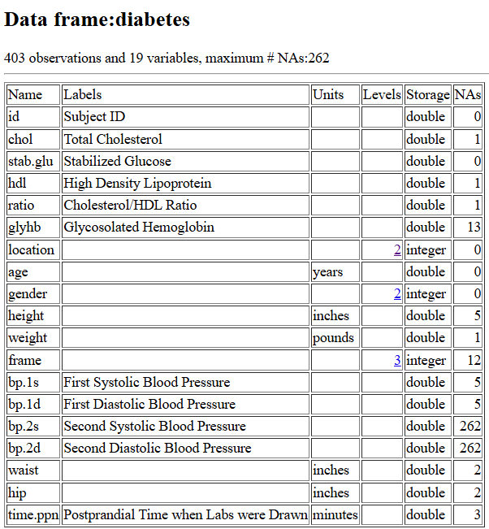

\tableofcontents  
\newpage

probando cambios

```{r setup, include=FALSE}
knitr::opts_chunk$set(echo = TRUE)
```

# Sección 1. Contexto y objetivo del estudio.

Para realizar esta actividad hemos seleccionado el conjunto de datos "Diabetes data", cedidos por el Dr. Dr John Schorling de la Facultad de Medicina de la Universidad de Virgina y publicados en la página <https://hbiostat.org/data/>. Este conjunto de datos consta de 19 variables medidas para 403 sujetos, y su objetivo original era analizar la prevalencia de la obesidad, la diabetes y otros factores de riesgo cardiovascular en individuos afroamericanos de Virginia central.Las variables que contien son: ID del paciente, nivel de colesterol, nivel de glucosa estable en sangre en ayunas, nivel de HDL, relación entre colesterol total y colesterol HDL, el nivel de hemoglobina glicosilada, la ubicación geográfica del paciente, la edd, el sexo, la altura, el peso, la complexión, el diámetro de la cintura, el diámetro de la cadera, la tensión sistólica y diastólica medidas en 2 ocasiones y el tiempo transcurrido entre la última comida y el análisis. 

Nuestro propósito de partida era examinar las relaciones estadísticas entre múltiples marcadores o parámetros biológicos, en una N de sujetos lo más grande posible. Tras analizar distintos conjuntos, decidimos emplear el de Diabetes porque contiene múltiples variables que podemos representar y analizar en busca de correlaciones, así como una N de observaciones amplia (403). En definitiva, es un conjunto muy completo y permite hacer un buen estudio estadístico enmarcado en el ámbito biológico. 

Tras examinar cuidadosamente el conjunto de datos, nos propusimos usar la información contenida en él para buscar posibles marcadores que permitan realizar un diagnóstico temprano de la diabetes, o predecir qué pacientes son susceptibles de desarrollar diabetes en el futuro. Por ello, intentaremos, mediante estadística inferencial crear un modelo para predecir la diabetes.


## Inicialización entorno trabajo

```{r}
# definimos y ponemos el directorio de trabajo 
directorio_trabajo <- paste0(getwd(), ' ')
setwd(directorio_trabajo)  

# instalamos la librerias que vamos a utilizar
install_package <- function(package_name){
  if (!requireNamespace(package_name, quietly = TRUE)) {
    install.packages(package_name) 
  }

install_package("knitr")    # para la generación de tablas mas vistosas
install_package("glue")     # para formatear texto interpolando variables
install_package("ggplot")
install_package("cowplot")
install_package("corrplot")
install_package("tidyverse")  # para la regresión logística
install_package("ISLR")  # para la regresión logística
install_package("ggeffects")  # para la regresión logística múltiple
install_package("caret")
install_package("pROC")  # para la curva ROC
}

# cargamos las librerias que vamos a utilizar
library("knitr")    
library("glue")     
library("ggplot2")
library("cowplot")
library("corrplot")
library("tidyverse")  # para la regresión logística
library("ISLR")  # para la regresión logística
library("pROC")
library("ggeffects")  # para la regresión logística múltiple
library("caret")
library("pROC")   # para la curva ROC
```


# Sección 2. Prospección y preparación de los datos

Ahora, observaremos el contenido y la estructura del conjunto de datos, las variables presentes y su resumen estadístico, empleando las distintas funciones que hemos ido estudiando. Además, comprobaremos si contiene NAs y, en caso afirmativo, cuántos de ellos hay en cada columna.

## Descripción del conjunto de datos

{width="620"}

## Carga del dataset y exploración inicial

```{r}
diabetes_df <- read.csv("data/diabetes.csv")

str(diabetes_df)

```

```{r}
  # Comprobamos las primeras entradas del dataset
head(diabetes_df)
```


### Análisis de variables numéricas

```{r}
# Creamos una función para que la podamos reutilizar
estadisticos_columna <- function(col) {
  if (is.numeric(col)) {
    # Si es numérica, devolver resumen estadístico básico y el porcentaje de nulos
    # Para hacer el porcentaje basta con hacer la media del numero de nulos (nºnulos / nº valores de la columna)
    # Para los estadisticos eliminamos los valores faltantes con na.rm=TRUE
    return(c(
      Porcentaje_Nulos = round(mean(is.na(col)) * 100, 2),
      Min = round(min(col, na.rm = TRUE),2),
      Q1 = round(quantile(col, 0.25, na.rm = TRUE),2),
      Median = round(median(col, na.rm = TRUE),2),
      Mean = round(mean(col, na.rm = TRUE),2),
      Sd = round(sd(col, na.rm = TRUE),2),
      Q3 = round(quantile(col, 0.75, na.rm = TRUE),2),
      Max = round(max(col, na.rm = TRUE),2)
    ))
  } 
}

estadisticas_numericas <- function(df) {
  
# Escogemos solo las variables numéricas
columnas_numericas <- df[,sapply(df, function(x) is.numeric(x))]

# Aplicamos la funcion de estadísticos para cada variable
estadisticos <- lapply(columnas_numericas,estadisticos_columna)

# Convertir lista de vectores a data.frame
tabla_resumen <- do.call(rbind, estadisticos)

# Cramos el dataframe final añadiendo el nombre de las variables como primera columna
tabla_resumen <- data.frame(
  Variable = rownames(tabla_resumen),
  tabla_resumen, row.names = NULL)

# Mostrar la tabla de forma bonita
knitr::kable(tabla_resumen,
             caption = "Estadísticos de variables numéricas ",
             align = "lrrrrrrrr")
}

estadisticas_numericas(diabetes_df[, -1])
```

### Transformaciones y creación de variables sintéticas

Para los propósitos de nuestro estudio, vamos a eliminar las variables categóricas para poder hacer análisis estadísticos de las numéricas. Asimismo, eliminaremos los NA para que no causen problemas en lo pasos posteriores. Tenemos que transformar las magnitudes medidas para que estén en las unidades del sistema decimal, puesto que el peso está en libras y la altura en pulgadas.

Es cierto que hay muchas variables que contienen NAs, pero en la mayoría de los casos son minoritarios. Las excepciones son las variables bp.2s y bp.2d, de las cuales faltan más de la mitad de observaciones. Por esta razón, hemos decidido descartar estas 2 variables de nuestro análisis.

Para poder trabajar mejor con los datos, eliminamos los NAs y factorizamos las variables categóricas. Esto permite evitar errores en los cálculos y representaciones, y facilitar la creación de gráficos con una variable independiente no numérica, respectivamente. Asimismo, utilizaremos las variables disponibles para generar nuevos parámetros que, basándonos en la literatura, consideramos informativos. Concretamente, el índice de masa corporal (peso/altura\^2) y la relación cadera/cintura.

Para comprobar la consistencia de los datos contenidos en este conjunto, llevamos a cabo un análisis de los valores aberrantes (que se salen de rango) en las distintas variables empleadas.

```{r}
# función que pasa de pulgadas a metros
inches_to_meters <- function(inches) {
  meters <- inches * 0.0254
  return(meters)
}

# función que pasa de libras a kilos
pounds_to_kilos <- function(pounds){
  kilos <- pounds * 0.453592
}

# altura, cintura y cadera de pulgadas a metros

variables_en_pulgadas <- c("height","hip","waist")

diabetes_df[variables_en_pulgadas] <- lapply(
  diabetes_df[variables_en_pulgadas],
  inches_to_meters
)


# peso de libras a kilos
diabetes_df$weight <- pounds_to_kilos(diabetes_df$weight)
```

### Objetivos del estudio

Nos hemos planteado las siguientes preguntas/objetivos a partir del conjunto de datos seleccionado:

1)  En base al nivel de hemoglobina glicosilada, queremos saber, basándonos en la literatura, si el paciente puede ser clasificado como diabético. Hemos visto que normalmente se considera que una persona es diabética si presenta un nivel de GlyHb del 6,5% o más.

2)  En base a la tensión arterial, investigaremos si el paciente es hiper- o hipotenso. Se considera hipertenso si la PS es igual/mayor de 140 mmHg y la PD es igual/mayor de 90 mmHg. Se considera hipotenso si la PS es menor de 90 y la PD menor de 60.

3)  Estudiaremos la relación cintura/cadera para ver si el paciente es obeso y si la obesidad/no obesidad afecta a la diabetes.

4)  Estudiaremos el índice de masa corporal por la misma razón que el punto 3), para comparar ambos parámetro entre sí y con la presencia/ausencia de diabetes diagnosticada.


```{r}
# indice de masa corporal
diabetes_df$BMI <- diabetes_df$weight / diabetes_df$height^2

# ratio cintura cadera (Waist Hip Ratio)
diabetes_df$WHR <- diabetes_df$waist / diabetes_df$hip
```

Después de hacer las transformaciones y la creación de nuevas variables veamos como queda finalmente nuestro conjunto de datos.

```{r}

estadisticas_numericas(diabetes_df[, -1])
```


### Análisis de variables categoricas

-   Cambiar algunas variables a tipo factor

```{r}
columnas_factorizables <- c("location", "gender", "frame")

diabetes_df[columnas_factorizables] <- lapply(
  diabetes_df[columnas_factorizables],
  as.factor)

  # Eliminamos el nivel extra de Frame
diabetes_df <- diabetes_df[diabetes_df$frame != "", ]  # Filtra filas con factor diferente de ""
diabetes_df$frame <- droplevels(diabetes_df$frame)    # Elimina el nivel vacío de los factores


str(diabetes_df[columnas_factorizables])

  # Factorizamos la edad
diabetes_df$age <- cut(diabetes_df$age,   # partimos la variable...
  breaks = seq(0, 100, by = 10),          # ...en intervalos de 10 años
  right = FALSE,                 # intervalo cerrado a la izquierda [x,y)
  include.lowest = TRUE          # incluye el primer valor en el primer grupo
)
```

-   Sintesis de variables categóricas

    -   Diabetes: $SI/NO$. Supondremos diabetes tipo 2 si el porcentaje de glucosa o azucar en sangre (glyhb) supera el 6.5% . Para simplificar no crearemos el grupo de prediabetes (glyhb entre 5.7 y 6.4%)

    -   Hipertenso: $SI/NO$. Supondremos hypertensión si la presión sistólica es mayor de 140 o la diastólica es mayor de 90

```{r}
# suponemos que es diabético si glyhb >= 6.5
diabetes_df$diabetes <- cut(diabetes_df$glyhb,
                            breaks = c(0,  6.49, Inf),
                            labels = c("NO","SI"),
                            right = TRUE) # right=TRUE => intervalo es (a, b]

diabetes_df$hipertenso <- as.factor(ifelse(
                                      diabetes_df$bp.1s >= 140 &
                                      diabetes_df$bp.1d >= 90,
                                      "SI",
                                      "NO")
                                    )
summary(diabetes_df[,c("diabetes","hipertenso")])
```


# Sección 3. Análisis exploratorio de los datos

## 3.1 Análisis descriptivo

```{r, fig.width=15, fig.height=9}
diabetes_df_limpio <- na.omit(diabetes_df)

columnas_numericas <- diabetes_df_limpio[,sapply(diabetes_df_limpio, function(x) is.numeric(x))]

cor(columnas_numericas)

head(diabetes_df_limpio)
```

```{r, fig.width=15, fig.height=9}
# creamos la matriz de correlación de las variables numéricas (quitando ID)
matriz_correlacion <- cor(columnas_numericas[, -1], method = "pearson", use = "pairwise.complete.obs")

# representamos los datos de manera más amigable empleando la función corrplot()
corrplot(matriz_correlacion,
             method = "circle",      # "circle", "square", "ellipse", "number", "shade", "color", "pie"
             type = "upper",          # "full", "lower", "upper"
             tl.col = "black",      # Color del texto de las etiquetas
             tl.srt = 45,           # Rotación del texto de las etiquetas
             addCoef.col =  NULL, # Añadir coeficientes si el método es 'number' o el tipo es 'full'
             number.cex = 0.7,      # Tamaño de los números si se muestran
             order = "hclust",      # Reordenar variables por clustering jerárquico para ver patrones
             na.label = "NA",       # Etiqueta para NAs en la matriz
             na.label.col = "grey"
            )
```


```{r, fig.width=15, fig.height=15}
grafico_1 <- ggplot(diabetes_df_limpio, aes (x = age, y = glyhb)) +
  geom_boxplot() +     # Definimos tipo de gráfico
  xlab("Edad") +     # Etiqueta eje X
  ylab ("Hemoglobina glicosilada") +    # Etiqueta eje Y
  ggtitle ("Nivel de hemoglobina glicosilada según la edad") +    # Título gráfico
 theme_classic() +
  theme(    
    axis.title.x = element_text(margin = margin(t = 15)),
    axis.title.y = element_text(margin = margin(r = 15))
  )

grafico_2 <- ggplot(diabetes_df_limpio, aes (x = gender, y = glyhb)) +
  geom_boxplot() +     # Definimos tipo de gráfico
  xlab("Sexo") +     # Etiqueta eje X
  ylab ("Hemoglobina glicosilada") +    # Etiqueta eje Y
  ggtitle ("Nivel de hemoglobina glicosilada según el sexo") +    # Título gráfico
 theme_classic() +
  theme(    
    axis.title.x = element_text(margin = margin(t = 10)),
    axis.title.y = element_text(margin = margin(r = 10))
  )


grafico_3 <- ggplot(diabetes_df_limpio, aes (x = frame, y = glyhb)) +
  geom_boxplot() +     # Definimos tipo de gráfico
  xlab("Complexión") +     # Etiqueta eje X
  ylab ("Hemoglobina glicosilada") +    # Etiqueta eje Y
  ggtitle ("Nivel de hemoglobina glicosilada según la complexión") +    # Título gráfico
 theme_classic() +
  theme(    
    axis.title.x = element_text(margin = margin(t = 15)),
    axis.title.y = element_text(margin = margin(r = 15))
  )
  
grafico_4 <- ggplot(diabetes_df_limpio, aes (x = hipertenso, y = glyhb)) +
  geom_boxplot() +     # Definimos tipo de gráfico
  xlab("Hipertensión") +     # Etiqueta eje X
  ylab ("Hemoglobina glicosilada") +    # Etiqueta eje Y
  ggtitle ("Relación entre hemoglobina glicosilada y tensión arterial") +    # Título gráfico
 theme_classic() +
  theme(    
    axis.title.x = element_text(margin = margin(t = 15)),
    axis.title.y = element_text(margin = margin(r = 15))
  )

grafico_5 <- ggplot(diabetes_df_limpio, aes (x = BMI, y = glyhb)) +
  geom_point() +     # Definimos tipo de gráfico
  xlab("BMI") +     # Etiqueta eje X
  ylab ("Hemoglobina glicosilada") +    # Etiqueta eje Y
  ggtitle ("Relación entre hemoglobina glicosilada y BMI") +    # Título gráfico
 theme_classic() +
  theme(    
    axis.title.x = element_text(margin = margin(t = 15)),
    axis.title.y = element_text(margin = margin(r = 15))
  )

grafico_6 <- ggplot(diabetes_df_limpio, aes (x = ratio, y = glyhb)) +
  geom_point() +     # Definimos tipo de gráfico
  xlab("ratio HDL/colesterol") +     # Etiqueta eje X
  ylab ("Hemoglobina glicosilada") +    # Etiqueta eje Y
  ggtitle ("Relación entre hemoglobina glicosilada y ratio colesterol") +    # Título gráfico
 theme_classic() +
  theme(    
    axis.title.x = element_text(margin = margin(t = 15)),
    axis.title.y = element_text(margin = margin(r = 15))
  )

plot_grid(grafico_1, grafico_2, grafico_3, grafico_4,grafico_5,grafico_6,  ncol = 2, nrow =3)
```


```{r, fig.width=15, fig.height=12}
grafico_7 <- ggplot(diabetes_df_limpio, aes (x = WHR, y = glyhb)) +
  geom_point() +     # Definimos tipo de gráfico
  xlab("WHR") +     # Etiqueta eje X
  ylab ("Hemoglobina glicosilada") +    # Etiqueta eje Y
  ggtitle ("Relación entre hemoglobina glicosilada y ratio cintura/cadera") +    # Título gráfico
 theme_classic() +
  theme(    
    axis.title.x = element_text(margin = margin(t = 15)),
    axis.title.y = element_text(margin = margin(r = 15))
  )

grafico_8 <- ggplot(diabetes_df_limpio, aes (x = BMI, y = hipertenso)) +
  geom_point() +     # Definimos tipo de gráfico
  xlab("WHR") +     # Etiqueta eje X
  ylab ("Hipertensión") +    # Etiqueta eje Y
  ggtitle ("Relación entre hemoglobina glicosilada y ratio cintura/cadera") +    # Título gráfico
 theme_classic() +
  theme(    
    axis.title.x = element_text(margin = margin(t = 15)),
    axis.title.y = element_text(margin = margin(r = 15))
  )

grafico_9<- ggplot(diabetes_df_limpio, aes (x = diabetes, y = ratio)) +
  geom_boxplot() +     # Definimos tipo de gráfico
  xlab("Diabetes") +     # Etiqueta eje X
  ylab ("Ratio") +    # Etiqueta eje Y
  ggtitle ("Relación entre Diabetes y ratio") +    # Título gráfico
 theme_classic() +
  theme(    
    axis.title.x = element_text(margin = margin(t = 15)),
    axis.title.y = element_text(margin = margin(r = 15))
  )

plot_grid(grafico_7, grafico_8, grafico_9, ncol = 2, nrow =2)
```


## 3.2 Estudio probabilístico

```{r}
frec<- table(diabetes_df_limpio$diabetes)/length(diabetes_df_limpio$diabetes) #buscamos las frecuencias y generamos una tabla
print(frec) #tabla de frecuencias

frec<- table(diabetes_df_limpio$hipertenso)/length(diabetes_df_limpio$hipertenso) #buscamos las frecuencias y generamos una tabla
print(frec) #tabla de frecuencias


```

En base a esto, si asumimos que éstas son las probabilidades para la ocurrencia de estos fenómenos podemos realizar algunas simulaciones probabilísticas de interés. Por ejemplo, si tuviéramos 1.000 pacientes, ¿cuál sería la probabilidad de que al menos 280 fueran diabéticos? ¿Y de que al menos 600 fueran hipertensos? Otro ejemplo: probabilidad de que al menos 300 tengan ambas patologías. Por último, la probabilidad de que menos del 30% sean diabéticos.

```{r}

  # Probabilidad de al menos 280 diabéticos
n = 1000 # número de pacientes
p1 = 0.25 # probabilidad de que el paciente sea diabético
val1 = 279 # valor exacto
paste("Probabilidad de que haya 280 o más diabéticos:", 1 - pbinom(val1, n, p1))

# Probabilidad de que menos de 200 sean diabéticos
paste("Probabilidad de que menos de 200 sean diabéticos:", pbinom (199, 1000, 0.25))

  # Probabilidad de al menos 600 hipertensos
n = 1000 #número de pacientes
p2 = 0.61 #probabilidad de que el paciente sea hipertenso
val2 = 599 #valor exacto
paste("Probabilidad de que haya 600 o más hipertensos:", 1 - pbinom(val2, n, p2))

  # Probabilidad de al menos 300 hipertensos diabéticos
paste("Probabilidad de que haya al menos 300 hipertensos diabéticos:", (1 - pbinom(299, n, p1)) * (1 - pbinom(299, n, p2)))
```

## Muestreo

Aquí lo que pruebo es si podemos sacar una muestra al azar de nuestro grupo de pacientes y comprobar si una variable se distribuye de manera normal en ellos. Primero se hace el muestreo y luego verificamos si la distribución es normal, tanto visualmente como con un test estadístico (Shapiro).

```{r}
  # Sacamos una muestra de nuestros pacientes y estudiamos una variable
set.seed(123)
n <- 100
muestra_diabetes <- sample(1:nrow(diabetes_df_limpio), n, replace = FALSE)
observaciones_muestreadas <- diabetes_df_limpio[muestra_diabetes, ]
head(observaciones_muestreadas)
```

```{r}
  # Comprobación visual de normalidad
plot(density(observaciones_muestreadas$glyhb),
     main = "Gráfico de densidad de Hemoglobina glicosilada",
     xlab = "GlyHb")
```


```{r}
# Comprobación estadística de normalidad
shapiro.test(observaciones_muestreadas$glyhb)

```


# Sección 4. Modelos de aprendizaje automático

Por ejemplo

-   Regresión logística para intentar predecir diabetes.

-   Análisis cluster


## Comprobaciones resultados diabetes vs ratio

```{r}
  # Comprobamos la normalidad de los datos de ratio de pacientes con y sin diabetes
shapiro.test(diabetes_df_limpio$ratio[diabetes_df_limpio$diabetes == "SI"])
shapiro.test(diabetes_df_limpio$ratio[diabetes_df_limpio$diabetes == "NO"])
```
Como p<0.05, no podemos asumir que son datos normales. Hay que usar un test no paramétrico como Wilcoxon o Krustal-Wallis. Al tener sólo 2 grupos, empleamos Wilcoxon.

```{r}
wilcox.test(ratio ~ diabetes, data = diabetes_df_limpio)
```

Dado que el p-value es mucho menor de 0.05, podemos asumir que ambos grupos son diferentes. ****


## Regresión linal simple

Relación entre glyhb y glucosa
```{r}
ggplot(diabetes_df_limpio, aes (x = diabetes_df_limpio$stab.glu, y = diabetes_df_limpio$glyhb)) +
  geom_point(aes(fill = diabetes_df_limpio$stab.glu)) +     # Definimos tipo de gráfico
  xlab("glucosa") +     # Etiqueta eje X
  ylab ("glicosilada") +    # Etiqueta eje Y
  ggtitle ("Nivel de hemoglobina glicosilada según el valor de la glucosa") +    # Título gráfico
  geom_smooth(method = "lm", se = FALSE, color = "red", linewidth = 0.5)   # Línea de regresión sin IC 
 
```

Relación entre glyhb y ratio
```{r}
ggplot(diabetes_df_limpio, aes (x = diabetes_df_limpio$ratio, y = diabetes_df_limpio$glyhb)) +
  geom_point(aes(fill = diabetes_df_limpio$ratio)) +     # Definimos tipo de gráfico
  xlab("ratio") +     # Etiqueta eje X
  ylab ("glicosilada") +    # Etiqueta eje Y
  ggtitle ("Nivel de hemoglobina glicosilada según el valor de ratio") +    # Título gráfico
  geom_smooth(method = "lm", se = FALSE, color = "red", linewidth = 0.5)   # Línea de regresión sin IC 
 
```


## Regresión lineal múltiple para ver determinación de la diabetes

```{r}
cor(columnas_numericas[,-1])
```


```{r}
  
mrm_diabetes <- lm(columnas_numericas$glyhb ~ columnas_numericas$stab.glu + columnas_numericas$chol + columnas_numericas$hdl + columnas_numericas$ratio + columnas_numericas$bp.1s + columnas_numericas$bp.1d + columnas_numericas$BMI + columnas_numericas$WHR)

summary(mrm_diabetes)
```
Buscamos los predictores óptimos:

```{r}
  # Con la función step() buscamos los mejores predictores para nuestra variable
step(object=mrm_diabetes,direction ="both", trace=1)
```


El mejor conjunto de predictores es:

```{r}
  # Salida de la función step(): mejor combinación de variables independientes
best_mrm_diabetes <- lm(formula = columnas_numericas$glyhb ~ columnas_numericas$stab.glu 
                        + columnas_numericas$hdl + columnas_numericas$ratio)

summary(best_mrm_diabetes)
```

## Prueba de un Análisis de Componentes Principales

```{r}
  # Estandarizamos los datos para que se ajusten a la distribución Z
estandarizado_diabetes <- scale(columnas_numericas[,-1])
head(estandarizado_diabetes)
```

```{r}
  # Aplicamos PCA
pca_resultado <- prcomp(estandarizado_diabetes, center = TRUE, scale =
TRUE)

  # Resumen de la varianza explicada por cada variable
summary(pca_resultado)
```

```{r}
#plot(pca_resultado)

barplot(pca_resultado$sdev[1:10]**2,
        names.arg = paste0("PC ", 1:10),
        col = "grey",
        main = "Resultados PCA Diabetes",
        ylab = "Variances")
```

```{r}
  # Comprobamos cuánto contribuye cada variable a distintos PC
cargos <- pca_resultado$rotation
cargos
```

## Agrupamiento no jerárquico con k means

Vamos a ver si el análisis agrupado de las distintas variables numéricas medidas permite agrupar los datos empleando un algoritmo de clasificación no supervisado: el k-means. Para ello primero hay que crear una semilla, y luego aplicar la función kmeans() a las variables a emplear, teniendo en cuenta el número de grupos esperados. Como aquí tenemos diabéticos y no diabéticos, vamos a probar con un k=2.


```{r}
# Aplicar k-means con k=2 (2 clústeres)
k <- 2
set.seed(123) # Fijamos una semilla para reproducibilidad
kmeans_resultado <- kmeans(columnas_numericas[,-1], centers = k)

# extraemos del resultado 2 datos importantes: las asignaciones y los centros
asignaciones <- kmeans_resultado$cluster
centros <- kmeans_resultado$centers

# Convertimos los centros calculados en un data frame
centros_df <- as.data.frame(centros)

# Representamos un gráfico de dispersión de los datos con colores para los clústeres
ggplot(columnas_numericas, aes(x = hdl, y = ratio, color =
factor(asignaciones))) +
geom_point() +
geom_point(data = centros_df, aes(x = hdl, y = ratio),
color = "black", size = 3, shape = 4) +
labs(title = "Segmentación de Pacientes por K-Means")
```

No se puede separar en grupos usando "K-means"


## Regresión logística simple


## Regresión logística múltiple

### El código que me ha pasado Otelo:

```{r}
#fijamos la semilla
set.seed(666)

# extraemos los indices de las muestras que conformarán el dataset de training
# para ello usamos la funcion createDataPartition de la libreria caret
# https://www.rdocumentation.org/packages/caret/versions/7.0-1/topics/createDataPartition
train_index <- createDataPartition(
                    diabetes_df_limpio$diabetes,
                    p = 0.7,
                    list = FALSE,
                    times = 1
)

# definimos el conjunto de entrenamiento
training_set <- diabetes_df_limpio[train_index,]

# definimos el conjunto de prueba (total - conjunto entrenamiento)
test_set <- diabetes_df_limpio[-train_index,]
 
# validar que el conjunto de entrenamiento está equilibrado:
# vemos si hay una distribución razonable de diabéticos y no diabéticos en cada
# conjunto.
print("training set")
print(summary(training_set[,c("diabetes","hipertenso","frame")]))

print("test set")
print(summary(test_set[,c("diabetes","hipertenso","frame")]))


# creamos el modelo con las variables que decidamos
predictores <- c("hipertenso","frame","BMI","WHR","ratio","stab.glu","chol", "hdl","bp.1s","bp.1d")

formula_str <- paste("diabetes","~", paste(predictores, collapse=" + "))
formula <- as.formula(formula_str)

cat("La formula que utilizaremos es: \n", formula_str)

modelo_logistico <- glm(formula, data=training_set, family = "binomial")
print(summary(modelo_logistico))
```

```{r}
# Buscamos el ajuste óptimo con el método stepwise
modelo_step <- step(modelo_logistico, direction = "both", trace = FALSE)
summary(modelo_step)
```

```{r}
# creamos el modelo sólo con las variables que step() nos dice
predictores <- c("stab.glu","chol")

formula_str <- paste("diabetes","~", paste(predictores, collapse=" + "))
formula <- as.formula(formula_str)

cat("La formula que utilizaremos es: \n", formula_str)

modelo_logistico <- glm(formula, data=training_set, family = "binomial")
print(summary(modelo_logistico))
```


```{r}

prob_test <- predict(modelo_logistico, newdata = test_set, type="response")

clase_positiva <- levels(training_set$diabetes)[2] # diabéticos
clase_negativa <- levels(training_set$diabetes)[1] # no diabéticos

clase_predicha <- factor(
                    ifelse(prob_test > 0.5 , clase_positiva, clase_negativa),
                    levels = levels(test_set$diabetes))

matriz_confusion <- confusionMatrix(data = clase_predicha,
                                    reference = test_set$diabetes,
                                    positive = clase_positiva)
print(matriz_confusion)
```


Empleamos una curva ROC para evaluar la precisión predictiva del modelo, fijándonos en el área bajo la curva (AUC).

```{r}

roc_test <- roc(response = test_set$diabetes,
                predictor = prob_test,
                levels = rev(levels(test_set$diabetes)), direction = ">")
plot(roc_test, print.auc = TRUE)
```


## Aquí acaba

¿Hacer ANOVA? Si sólo hay un grupo no tiene sentido.


# Sección 5. Visualización

```{r}
  # Convertimos en .csv sin números de fila para cargarlo en Shiny
write.csv(diabetes_df_limpio, "diabetes_limpio.csv", row.names = FALSE)
```

```{r, message=FALSE, warning=FALSE, results='hide'}
library(shiny)  # Cargamos el paquete shiny
library(ggplot2)  # Cargamos el paquete ggplot2
library(DT)

# Definimos la interfaz de usuario (UI) con la función fluidPage()
ui <- fluidPage(titlePanel(textOutput("titulo_archivo")),
                # Título de la aplicación dependiente del archivo cargado
                
                # Entrada de datos de tipo numérico con numericInput()
                # Entrada de datos categóricos con selectInput()
                sidebarLayout(
                  sidebarPanel(
                    fileInput("file", "Especifica el conjunto de datos a mostrar"),
                    
                    uiOutput("x_selector"),
                    uiOutput("y_selector"),
                    
                    # Definimos los selectores de variables x e y
                    
                    selectInput(
                      "plot_type",
                      "Selecciona el tipo de gráfico:",
                      choices = c(
                        "Gráfico de dispersión" = "scatter",
                        "Gráfico de barras" = "bars",
                        "Histograma" = "histogram"
                      )
                    ),
                    actionButton("show_summary", "Resumen parámetros estadísticos"),
                    hr()
                  ),
                  
                  # Resultados panel principal
                  mainPanel(plotOutput("plot"), DTOutput("tabla"))
                ))


# Definimos los parámetros del servidor
server <- function(input, output) {
  data <- reactive({
    req(input$file)
    read.csv(input$file$datapath, row.names = NULL)   # Los datos usados dependen del archivo seleccionado
  })
  
  # Definimos título dependiente del archivo
  output$titulo_archivo <- renderText({
    if (is.null(input$file)) {
      # Si no se ha cargado ningún archivo
      "Cargue un archivo"
    } else {
      nombre_limpio <- tools::file_path_sans_ext(input$file$name)
      nombre_capitalizado <- paste0(toupper(substring(nombre_limpio, 1, 1)), substring(nombre_limpio, 2))
      
      paste(nombre_capitalizado)
    }
  })
  
  # Detecta las variables del archivo cargado
  output$x_selector <- renderUI({
    req(data())
    selectInput("x", "Selecciona la variable X:", choices = names(data()))
  })
  
  output$y_selector <- renderUI({
    req(data())
    selectInput("y", "Selecciona la variable Y:", choices = names(data()))
  })
  
  
  # Creamos los gráfico de salida a elegir
  output$plot <- renderPlot({
    req(data())   # Te pide que selecciones las variables
    x <- input$x   # Valores X elegidos
    y <- input$y    # Valores Y elegidos
    plot_type <- input$plot_type   # El gráfico depende de la selección
    
    if (plot_type == "histogram") {
      req(input$x)
    } else {
      # Para scatter y barras req(x,y)
      req(input$x, input$y)
    }
    
    tryCatch({
      df <- data()
      x <- input$x
      y <- input$y
      
      if (plot_type == "scatter") {
        ggplot(df, aes_string(x, y)) +
          geom_point() +
          xlab(x) + ylab(y) +
          ggtitle("Gráfico de Dispersión")
        
      } else if (plot_type == "bars") {
        ggplot(df, aes_string(x, y)) +
          geom_bar(stat = "identity") +
          xlab(x) + ylab(y) +
          ggtitle("Gráfico de Barras")
        
      } else if (plot_type == "histogram") {
        if (is.numeric(df[[x]])) {
          ggplot(df, aes_string(x)) +
            geom_histogram(
              fill = "blue",
              color = "black",
              bins = 30
            ) +
            xlab(x) + ylab("Frecuencia") +
            ggtitle("Histograma")
        } else {
          plot.new()
          text(0.5,
               0.5,
               "No se puede hacer histograma con variable categórica",
               cex = 1.2)
        }
      }
    }, error = function(e) {
      plot.new()
      text(0.5, 0.5, paste("Error en el gráfico:", e$message), cex = 1)
    })
  })
  
  # Salida de texto
  
  # Creamos una función para que la podamos reutilizar
  estadisticos_columna <- function(col) {
    if (is.numeric(col)) {
      # Si es numérica, devolver resumen estadístico básico y el porcentaje de nulos
      # Para hacer el porcentaje basta con hacer la media del numero de nulos (nºnulos / nº valores de la columna)
      # Para los estadisticos eliminamos los valores faltantes con na.rm=TRUE
      return(
        c(
          Porcentaje_Nulos = round(mean(is.na(col)) * 100, 2),
          Min = round(min(col, na.rm = TRUE), 2),
          Q1 = round(quantile(col, 0.25, na.rm = TRUE), 2),
          Median = round(median(col, na.rm = TRUE), 2),
          Mean = round(mean(col, na.rm = TRUE), 2),
          Sd = round(sd(col, na.rm = TRUE), 2),
          Q3 = round(quantile(col, 0.75, na.rm = TRUE), 2),
          Max = round(max(col, na.rm = TRUE), 2)
        )
      )
    }
  }
  
  estadisticas_numericas <- function(df) {
    # Escogemos solo las variables numéricas
    columnas_numericas <- df[, sapply(df, function(x)
      is.numeric(x))]
    
    # Aplicamos la funcion de estadísticos para cada variable
    estadisticos <- lapply(columnas_numericas, estadisticos_columna)
    
    # Convertir lista de vectores a data.frame
    tabla_resumen <- do.call(rbind, estadisticos)
    
    # Cramos el dataframe final añadiendo el nombre de las variables como primera columna
    tabla_resumen <- data.frame(Variable = rownames(tabla_resumen),
                                tabla_resumen,
                                row.names = NULL)
    
    return(tabla_resumen)
    
  }
  
  output$tabla <- renderDT({
    # accedemos al valor actual de los datos provenientes del archivo
    req(data())
    if (input$show_summary > 0) {
      # Si haces click en el botón
      df <- estadisticas_numericas(data())    # Muestra el resumen de los datos
      
      
      # En caso de que tengamos datos montamos la tabla
      datatable(
        df,
        options = list(
          pageLength = 16,
          # Filas por página
          scrollX = TRUE,
          # Scroll horizontal si hay muchas columnas
          searching = FALSE # Habilitar búsqueda
        ),
        rownames = FALSE # No mostrar nombres de fila por defecto de R
      )
    }
  })
}


# Creamos la aplicación Shiny
shinyApp(ui = ui, server = server)
```

# Sección 6. Conclusiones

## En base a todo el estudio realizado en esta práctica, haga una valoración final. Para ello, puede basarse en las siguientes preguntas: "¿disponemos de conclusiones finales?", "¿sería necesario hacer un análisis más avanzado?", "¿faltan datos para obtener otro tipo de información como...?", “¿se puede utilizar alguna de las conclusiones para tomar algún tipo de decisiones?”.

En este estudio hemos realizado un análisis de las variables cuantitativas y cualitativas de un grupo amplio de pacientes (403), de los cuales un 
15,6% eran diabéticos y un 23,3 % eran hipertensos. El diagnóstico de diabetes se establece habitualmente en la práctica clínica cuando la hemoglobina glicosilada del paciente iguala o supera el 6,5%. Nuestro propósito principal era comprobar si alguna de las otras variables medidas en estos pacientes presentaba una correlación sólida con respecto a la hemoglobina glicosilada, y, por tanto, si podía servir como marcador biologico para establecer el riesgo de diabetes antes de debutar con la enfermedad.

Nuestro análisis estadístico descriptivo reveló cierto nivel de correlación entre los niveles de hemoglobina glicosilada y los de la variable... Por ello, decidimo realizar un análisis inferencial con el propósito de comprobar si un modelo basado en esa correlación podría ayudarnos a diagnosticar la diabetes empleando la variable... Hemos entrenado un modelo con machine learning, aportándole una parte de los datos de nuestro estudio (asegurándonos de que eran homogéneos y representativos del grupo de pacientes). A continuación, hemos probado este modelo con el resto de los datos disponibles. La capacidad del modelo para establecer el diagnóstico de diabetes correctamente usando la variable... como predictor fue del .....%. Este nivel de acierto supera al mero azar, aunque tiene un notable espacio de mejora. Por ello, consideramos que habría que explorar otro tipo de variables biológicas para ver si se puede encontrar un marcador más eficiente para predecir el debut de la diabetes y actuar de urgencia sobre el paciente con el fin de intentar evitarlo.


## En otro orden de cuestiones, valorad también el trabajo en grupo y la calidad del informe de análisis de datos generado.

### Valoración Otelo

Por mi parte solo puedo decir cosas positivas del trabajo que hemos hecho. El trato con Enrique ha sido muy bueno desde el primer dia que nos conocimos. Ha sido fácil el llegar a acuerdos con él, desde la elección del dataset a estudiar  pasando por todos los puntos del trabajo.

Hemos hecho varias sesiones de trabajo en conjunto donde debatíamos los puntos que nos habiamos comprometido a estudiar previamente, llegando a un consenso en estos puntos y proponiendo hitos para la siguiente sesión.

Aún con la diferencia de nuestros perfiles ( Enrique es bioquímico y yo ingeniero en informática) nos hemos sabido complementar bastante bien y creo que hemos aprendido el uno del otro.

A nivel técnico nos hemos organizado compartiendo el código y documentos a través de github, cosa que al principio parecia muy buena idea, pero al intentar usarlo desde Rstudio nos hemos encontrado con muchos problemas y al final hemos tenido que hacer las sincronizaciones a mano.

